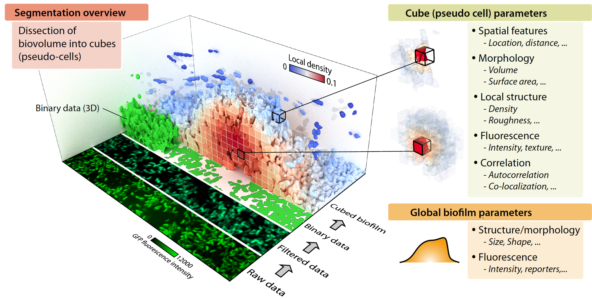

.. BacBQ documentation master file, created by
   sphinx-quickstart on Thu Nov 15 11:58:10 2018.
   You can adapt this file completely to your liking, but it should at least
   contain the root `toctree` directive.

====================================================   
Welcome to the BiofilmQ documentation!
====================================================

:program:`BiofilmQ` is an advanced biofilm analysis tool for quantifying  
the properties of cells inside 3-dimensional biofilm communities in space and time.
It can work with many different kinds of 3D biofilm images, including flow-chamber biofilms,
colonies on agar, pellicles, and aggregates.

BiofilmQ is based on a graphical user interface and does not require programming expertise or prior knowledge of image analysis. 

BiofilmQ has two approaches for quantifying biofilm properties in space and time:

.. _stardistopp: https://github.com/gatoniel/merge-stardist-masks
.. |stardistopp| replace:: **StarDist OPP**

- **Case 1: The properties you are interested in do not require single cell detection or your image resolution is not sufficient to detect individual cells.**
 
  In this case, you can use the cube-based segmentation of BiofilmQ, during which
  the 3D biofilm biovolume is detected via thresholding and divided it into cubic *pseudo-cells*.
  Each cube is then treated as a single pseudo-cell for analysis purposes, for which fluorescence, architectural, spatial, and many more properties are measured. 
  Using this cube-based approach, it is possible to analyze the biofilm-internal structure, by performing biofilm image cytometry (analogous to flow cytometry, but with 
  spatial features), based on the quantification of many parameters for pseudo-cells.

- **Case 2: You already have a single-cell segmentation from another tool (e.g. our** |stardistopp|_ **tool) and would like to analyze single-cell data based on this segmentation.**
  
  In this case, you can import your segmentation into BiofilmQ using the label image approach. All subsequent analysis (parameter calculation, visualization, ...) can then be performed as usual based on the imported segmentation.
  This option was added in the 2023 release of BiofilmQ version 1.0.0 and is **the only way to analyze single-cell properties**.

BiofilmQ provides powerful analysis and plotting functionality for quantifying and presenting the data from each pseudo-cell cube or each cell (depending on which of the use cases descibed above are used). 
For example, it is possible to generate biofilm kymographs, demographs, and to  generate flow-cytometry-like
datasets, including population gating, which include not just fluorescence and structural properties of cells, but also spatial properties  within the biofilm.

The easy-to-use analysis and visualization features of BiofilmQ enable you to generate high-quality data
figures without any programming skills.

For advanced users with programming expertise, all features are fully scriptable (in MATLAB) for batch processing of large datasets.

Overview
########
.. raw:: html

	<iframe width="390" height="200" src="https://www.youtube-nocookie.com/embed/h9LQFJuDzC0?controls=0" frameborder="0" allow="accelerometer; autoplay; encrypted-media; gyroscope; picture-in-picture" allowfullscreen></iframe>
	<iframe width="390" height="200" src="https://www.youtube-nocookie.com/embed/hM3J7eHvcAA?controls=0" frameborder="0" allow="accelerometer; autoplay; encrypted-media; gyroscope; picture-in-picture" allowfullscreen></iframe>

Getting started
###############

.. toctree::
   :titlesonly:

   usage/workflow
   usage/installation
   usage/fileInput
   usage/image_preparation
   usage/segmentation
   usage/segmentation_import
   usage/parameter_calculation
   usage/cube_tracking
   usage/export
   usage/visualization
   usage/batch_processing
   usage/comstat_compatibility

Video tutorials
###############

.. toctree::
   :maxdepth: 1
   
   usage/video_tutorials
   
Join the forum!
###############################

We actively answer questions in the `image.sc <https://forum.image.sc/tags/biofilmq>`_ forum. If you have technical questions about BiofilmQ or find bugs, please use the `image.sc <https://forum.image.sc/tags/biofilmq>`_ forum.
   
More information
################

.. toctree::
   :maxdepth: 1

   usage/screenshots
   
About us
###########
 
BiofilmQ was developed by Raimo Hartmann, Hannah Jeckel, Eric Jelli, and Knut Drescher at the 
`Max Planck Institute for Terrestrial Microbiology <https://www.mpi-marburg.mpg.de/>`_ and the 
`Department of Physics of the Philipps-Universität Marburg <https://www.uni-marburg.de/de/fb13>`_.
For non-technical questions you can reach us at `biofilmQ@gmail.com <mailto:biofilmQ@gmail.com>`_. For technical questions, problems, suggestions for improvements please use the `image.sc <https://forum.image.sc/tags/biofilmq>`_ forum.

How to cite
###########

Please use the following reference for citing this software after you have used it: 

.. raw:: html

	<b>Quantitative image analysis of microbial communities with BiofilmQ.</b> 
	Raimo Hartmann*, Hannah Jeckel*, Eric Jelli*, Praveen K. Singh, Sanika Vaidya, Miriam Bayer, Daniel K.H. Rode, Lucia Vidakovic, Francisco Díaz-Pascual, Jiunn C.N. Fong, Anna Dragoš, Olga Besharova, Janne G. Thöming, Niklas Netter, Susanne Häussler, Carey D. Nadell, Victor Sourjik, Ákos T. Kovács, Fitnat H. Yildiz, Knut Drescher. 
	(* equal contributions) 
	<i>Nature Microbiology</i> (2021). <a href=https://doi.org/10.1038/s41564-020-00817-4> https://doi.org/10.1038/s41564-020-00817-4</a>

Search 
===============

* :ref:`search`

Credits	
#######

We would like to acknowledge the authors of the following MATLAB File Exchange contributions:

- David Sampson and Ben Tordoff `GUI Layout Toolbox <https://de.mathworks.com/matlabcentral/fileexchange/47982-gui-layout-toolbox>`_
- Ben Tordoff `Splash Screen <https://de.mathworks.com/matlabcentral/fileexchange/30508-splashscreen>`_
- Manuel Guizar `Efficient subpixel image registration by cross-correlation <https://de.mathworks.com/matlabcentral/fileexchange/18401-efficient-subpixel-image-registration-by-cross-correlation?focused=6461816&tab=function>`_
- Reza Ahmadzadeh `isToolboxAvailable <https://de.mathworks.com/matlabcentral/fileexchange/51794-istoolboxavailable>`_
- Ronald Ouwerkerk `Neighbour points in a matrix <https://de.mathworks.com/matlabcentral/fileexchange/29330-neighbour-points-in-a-matrix?focused=5169162&tab=function>`_
- Stefan Doerr `Progress bar for matlab loops (incl. parfor) <https://de.mathworks.com/matlabcentral/fileexchange/43872-progress-bar-for-matlab-loops-incl-parfor?s_tid=prof_contriblnk>`_
- Daniel Terry `parfor_progressbar <https://de.mathworks.com/matlabcentral/fileexchange/53773-parfor-progressbar>`_
- Yair Altman `findjobj <https://de.mathworks.com/matlabcentral/fileexchange/14317-findjobj-find-java-handles-of-matlab-graphic-objects>`_
- Yair Altman `UICOMPONENT - expands uicontrol to all Java classes <https://de.mathworks.com/matlabcentral/fileexchange/14583-uicomponent-expands-uicontrol-to-all-java-classes>`_
- Carl Philips and Daniel Li `cooc3d <https://de.mathworks.com/matlabcentral/fileexchange/19058-cooc3d#functions_tab>`_
- Jakub Nedbal `writeFCS(fname, DATA, TEXT, OTHER) <https://de.mathworks.com/matlabcentral/fileexchange/42603-writefcs-fname-data-text-other>`_
- Guillaume Flandin `mVTK - a VTK library for MATLAB <https://www.artefact.tk/software/matlab/mvtk/>`_
- Yanai Ankri `folderSizeTree <https://de.mathworks.com/matlabcentral/fileexchange/29198-foldersizetree>`_
- Philip Kollmannsberger `skeleton3d-matlab <https://github.com/phi-max/skeleton3d-matlab>`_
- Bruno Luong `FFT-based convolution <https://de.mathworks.com/matlabcentral/fileexchange/24504-fft-based-convolution>`_
- Jean-Yves Tinevez `matlab-tree <https://github.com/tinevez/matlab-tree>`_
- Ohad Gal `fit_ellipse <https://de.mathworks.com/matlabcentral/fileexchange/3215-fit_ellipse>`_
- David Legland `image ellipsoid 3D <https://de.mathworks.com/matlabcentral/fileexchange/34104-image-ellipsoid-3d?s_tid=prof_contriblnk>`_
- Laszlo Balkay `2D Histogram Calculation <https://de.mathworks.com/matlabcentral/fileexchange/9896-2d-histogram-calculation>`_
- Sylvain Fiedler `Cell Array to CSV-file [cell2csv.m] <https://de.mathworks.com/matlabcentral/fileexchange/4400-cell-array-to-csv-file-cell2csv-m>`_
- Jake Hughey `Ridler-Calvard image thresholding <https://de.mathworks.com/matlabcentral/fileexchange/44255-ridler-calvard-image-thresholding>`_
- Peter Hammer `Marching Cubes <https://de.mathworks.com/matlabcentral/fileexchange/32506-marching-cubes?s_tid=prof_contriblnk>`_
- Igor `Disk usage <https://de.mathworks.com/matlabcentral/fileexchange/41904-disk-usage?s_tid=prof_contriblnk>`_
- Sven Holcombe `stlwrite - write ASCII or Binary STL files <https://de.mathworks.com/matlabcentral/fileexchange/20922-stlwrite-write-ascii-or-binary-stl-files>`_
- Masayuki Tanaka `Noise Level Estimation from a Single Image <https://de.mathworks.com/matlabcentral/fileexchange/36921-noise-level-estimation-from-a-single-image>`_
- The Open Microscopy Environment `Bio-Formats <https://github.com/openmicroscopy/bioformats>`_
- Maysam Shahedi `imshow3D <https://de.mathworks.com/matlabcentral/fileexchange/41334-imshow3d>`_
- Yanai Ankri `folderSizeTree <https://de.mathworks.com/matlabcentral/fileexchange/29198-foldersizetree>`_
- Chad Greene `rgb2hex and hex2rgb <https://de.mathworks.com/matlabcentral/fileexchange/46289-rgb2hex-and-hex2rgb?s_tid=prof_contriblnk>`_
- Paul Proteus `Text progress bar <https://de.mathworks.com/matlabcentral/fileexchange/28067-text-progress-bar>`_ 
- Olivier Salvado `ordfilt3 <https://de.mathworks.com/matlabcentral/fileexchange/5722-ordfilt3?s_tid=prof_contriblnk>`_
- Damien Garcia `FSPECIAL3 Create predefined 3-D filters. <http://www.biomecardio.com/en/index.html>`_
- Jake Hughey `Ridler-Calvard image thresholding <https://de.mathworks.com/matlabcentral/fileexchange/44255-ridler-calvard-image-thresholding>`_ 
- Krishnan Padmanabhan `A novel algorithm for optimal image thresholding of biological data <https://ars.els-cdn.com/content/image/1-s2.0-S0165027010004917-mmc2.zip>`_
- Youssef Khmou `2D Autocorrelation function <https://de.mathworks.com/matlabcentral/fileexchange/37624-2d-autocorrelation-function?s_tid=prof_contriblnk>`_
- Johannes Korsawe `Minimal Bounding Box <https://de.mathworks.com/matlabcentral/fileexchange/18264-minimal-bounding-box?s_tid=prof_contriblnk>`_
- Douglas Schwarz `sort_nat: Natural Order Sort <https://de.mathworks.com/matlabcentral/fileexchange/10959-sort_nat-natural-order-sort>`_
