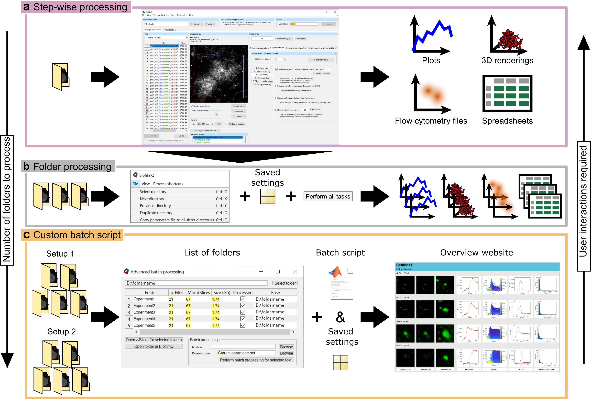
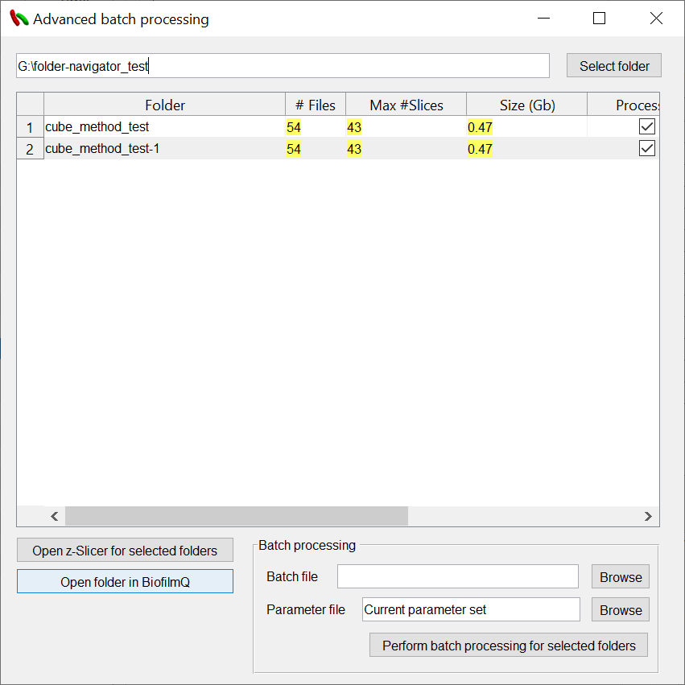

==================
Batch Processing
==================

At the very top of the BiofilmQ window, under the menubar item :guilabel:`Process shortcuts` you can find shortcuts
to automate your analysis pipeline. BiofilmQ offers 3 types of batch processing:

#. The :ref:`basic_batch_processing` allows you to define all processing parameters via the graphical user interface (GUI) and start a sequence of selected processing steps on the current experiment folder.
#. :ref:`intermediate_batch_processing` will use the current parameters to apply the same processing steps to several folders one-by-one.
#. If you are familiar with MATLAB programming, you can use :ref:`advanced_batch_processing` to programmatically click on buttons, modify internal data-structures etc. which allows you to use BiofilmQ based on external inputs.
	

	
Overview of *BiofilmQ* batch processing. **a** The simplest workflow for processing image
data in *BiofilmQ* relys on the user to provide the parameter settings  for the analysis
via the GUI and to go through the processing procedures step-by-step. This is the preferred
approach for analysing a single experiment folder or to test different settings for more
advanced batch processing steps. Depending on the size of the analysed data, however, a
step-wise approach is very time-consuming since the user has to wait for every processing
step to finish, before the next processing step can be started. Usually this generates a
limited number of analysis results in the shape of plots, 3D renderings, FCS files, and CSV
files which are all stored alongside the image data. **b** A more advanced batch processing
of multiple folders within the same parent directory can be used when multiple replicates
require the same parameter settings for the analysis. The parameter settings can be generated
by using the GUI and re-used for multiple folders.  This enables the user to quickly analyse
a relatively large number of folders with little to none user interaction within the
GUI. The user switches the experiment folder with a shortcut key and starts the processing
with a single batch processing button. The results of every single analysis is saved in
the individual experiment folders.  **c** For a large number of experiments with similar
but not identical analysis settings, a custom batch script can automatize the data analysis.
This is the preferred approach for analysing multiple folders from different biological
replicates with several technical replicates each. An additional batch processing dialogue
assists the user in the set up of the workflow. Besides a parameter file for the default
parameters, a custom batch script is needed. In the batch script, the user can implement
custom processing routines, modify the parameter setting for different experiment folders
based on external inputs, or just define the sequence of *BiofilmQ* analysis routines
which should be applied. Since this approach can quickly generate large amounts analysis
results, *BiofilmQ* can generate an overview website which gathers all generated
visualizations in one place. Figure adapted from [`2 <https://doi.org/21.11101/0000-0007-E856-3>`_].

	

.. _basic_batch_processing:
	
Basic Batch Processing
------------------------------------------
For basic batch processing you first have to select a sequence of processing steps via :guilabel:`Select Tasks`, which you want to apply
on the current :guilabel:`Experiment folder`, one ofter the other.
 
All major processing steps available to be selected as processing tasks:

* :ref:`image_alignment`
* :ref:`segmentation`
* :ref:`cell_parameter_calculation`
* :ref:`cube_tracking`
* :ref:`export_visualization`
* :ref:`export_fcs`
* :ref:`export_csv`

By clicking on a task you can select, or unselect it for the next basic batch run.
Alternatively you can use the menu items :guilabel:`Select all` or :guilabel:`Deselect all` to toggle all items at once.

After using the keyboard shortcut :guilabel:`Ctrl+P` or clicking on :guilabel:`Perform selected tasks on current experiment folder`, 
the program will process each task one-by-one. The tasks are executed in the order mentioned above. For each task, the parameters that have been 
previously defined in the GUI for the current experiment folder are used (these parameters are stored in the *parameters.mat*-file).

.. _intermediate_batch_processing:

Intermediate Batch Processing 
------------------------------------

With intermediate batch processing, selected tasks can be applied to all subfolders within the parent directory of the current experiment folder.
To enable this feature you have to select the option :guilabel:`Perform selected task on all experiment folders` under the menu item :guilabel:`Process shortcuts`/:guilabel:`Simple batch processing`.
Once you start the batch processing, and all the processing tasks have been selected as mentioned in :ref:`basic_batch_processing`, a message box will pop up, summarizing all directories which are going to be processed. By clicking on :guilabel:`Continue`
you will start the processing. The parameters used for the processing in each subfolder have to be defined before, either by setting the parameters in the GUI in each subfolder, or by copying the *parameters.mat*-file to each subfolder (if you want to use exactly the same parameters for every subfolder).

.. note::

	* After the processing of all directories is finished, the current :guilabel:`Experiment folder` will be changed to the last directory in your processing list.
	* For processing, the parameters stored in *parameters.mat* are used for each directory. If BiofilmQ processes a directory, which does not contain a *parameters.mat*-file, the parameters from the prevouis directory are used.
	

.. _advanced_batch_processing:

Advanced Batch Processing
--------------------------

The advanced batch processing capabilities of BiofilmQ offer proficient MATLAB users an interface to process and visualize large data sets fully autonomously from user input.

The basic batch processing and the intermediate batch processing options have the disadvantage that you cannot change
the parameters within a *Experiment folders*. Once the parameters are stored in the *parameters.mat* file you can not modify the parameters based
on intermediate results. Besides, if you conducted a large amount of different experiments that require different segmentation or visualization parameters, 
you may want to automatically modify the parameters for different directories.

Another advantage is that you are completely free in your directory organisation. You can jump from one experiment folder to another without the restriction to a one large folder
where all experiments are stored.

In contrast to the basic and intermediate batch processing, the advanced batch processing offers the possibility to programmatically control the BiofilmQ visualization features, 
which can be used to automatically generate a large number of plots without manual interaction on the GUI interface.

You start the advanced batch processing setup by clicking on the menu bar item  :guilabel:`Process shortcuts`/:guilabel:`Open advanced batch processing`.

A new window pops up, where you can use the button :guilabel:`Select folder` to browse folders which contain multiple experiments.
Each subfolder is scanned for `supported <fileInput.html>`_ microscope and image files. Only folders which contain supported files will be listed.

   
Each folder is listed with several features:

* Foldername (can not handle '.' properly)
* Number of supported files
* Max number of slices (extracted by the '_Nz' part of the filename)
* Total size in GB.
* Processed (detects the existence of a *data* subfolder)
* Base (parent folder of the listed experiment folder)

Based on the selected rows in the table you can

* Open the z-Slicer tool (multichannel orthoview slicer) for the selected folder.
* Open the selected folder in BiofilmQ.
* Perform batch processing for selected folders.

In order to perform batch processing, you have to select a batch file which should be executed. The MATLAB source code of BiofilmQ comes with a couple of 
simple batch scripts which can serve as examples when kicking off your own projects. You can find them in the *./batch processing*/*batchFiles* folder inside the ZIP archive.

.. note::

	Writing custom batch script can quickly escalate to a very complex topic!

In the text field :guilabel:`parameter file`, you can select a *parameters.mat* file of your choice. This file is usually created right after you have opened an unvisited experiment folder with
BiofilmQ and contains all GUI parameters which are needed for the processing step.

.. note::

	The parameter file *parameters.mat* is not automatically distributed to all visited directories. This has to be done inside the batch script. 
	Please consult the example batch scripts.
	
	
Batch scripting
###############

References (handles) to all GUI elements are stored inside *handles.uicontrols*. These can be used to interact with GUI elements programmatically.

Modify content of edit-fields:

.. code:: matlab

    handles.uicontrols.edit.(fieldName).String = '1';

Enable/disable checkboxes

.. code:: matlab

    handles.uicontrols.checkbox.(fieldName).Value = true/false;

Modify selection of popup menus:

.. code:: matlab

    handles.uicontrols.popupmenu.(fieldName).Value = 1;

Store values of in *parameter.mat* before processing:

.. code:: matlab

    storeValues(hObject, eventdata, handles);

Press pushbuttons:

.. code:: matlab
    
    BiofilmQ('pushbutton_action_imageRange_takeAll_Callback',handles.uicontrols.pushbutton.pushbutton_action_imageRange_takeAll,eventdata,guidata(hObject))
	
Advanced batch processing mode can also be used for automatic plot generation
-> References to all GUI elements from the analysis panel are stored in the variable: *handles.handles_analysis.uicontrols*
                
Update directory (variable *folders* contains all selected directory):

.. code:: matlab

    handles.uicontrols.edit.inputFolder.String = folders{i}; 

Press :guilabel:`Scan folder` - button

.. code:: matlab

    BiofilmQ('pushbutton_refreshFolder_Callback', hObject, eventdata, guidata(hObject));

Switch between per-object (1) and global biofilm measurements (2):

.. code:: matlab

    handles.handles_analysis.uicontrols.popupmenu.popupmenu_database.Value = 1;

Add field *Time* to x-axis specific field (1: x-axis, 2: y-axis, 3: z-axis, 4: color-axis, 5: filter-field):

.. code:: matlab

    biofilmAnalysis('pushbutton_addField_Callback', hObject, eventdata, handles, 1, 'Time')

Press :guilabel:`Plot` - button

.. code:: matlab

    biofilmAnalysis('pushbutton_kymograph_plot_Callback', hObject, eventdata,guidata(hObject))
