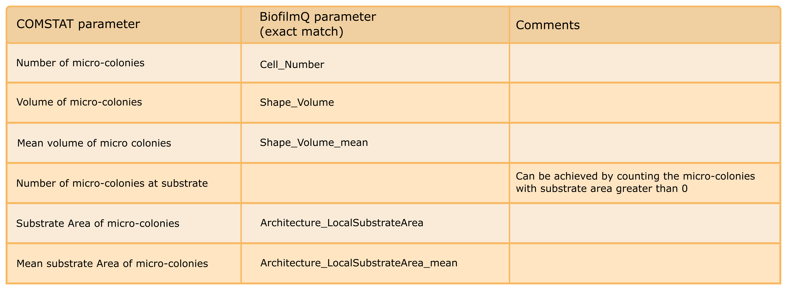

====================================
COMSTAT compatibility
====================================

COMSTAT is an early biofilm image analysis software tool that has been widely-used. COMSTAT was developed by Heydorn et al. (Microbiology, 2000 [1]_) . Most COMSTAT parameters can also be calculated using BiofilmQ with an identical algorithm, to enable compatibility. This section describes how to achieve this.

Segmentation
############

COMSTAT performs thresholding on the raw image data, which means that usually neither cropping nor filtering is applied prior to the segmentation. BiofilmQ offers to crop or denoise images by filters, however, all of these operations are optional. To achieve identical results to COMSTAT (no filtering and no croping), apply the thresholding without any cropping or filters by unchecking all of the corresponding checkboxes in the :guilabel:`Segmentation` tab.

If in COMSTAT, you prefer to use the thresholding by Otsu's method, go to :guilabel:`Segmentation`, and in the :guilabel:`Thresholding` tab choose :guilabel:`Otsu` in the drop-down menu. A new drop-down menu will appear below, in which you can choose the option "2" for the number of classes. Make sure that the text field :guilabel:`Sensitivity` is set to "1", otherwise change it. With these settings, the thresholding will be identical to the automatic thresholding of COMSTAT.

If you prefer manual thresholding in COMSTAT, go to :guilabel:`Segmentation` in the BiofilmQ window, and in the :guilabel:`Thresholding` tab choose :guilabel:`Manual` in the drop-down menu. You can now enter your manual threshold in the text field below.

Global and local parameters
##################################

Global parameters are parameters, that yield one scalar value for each image file, for example biovolume. Local properties are defined per pixel in COMSTAT and per cube in BiofilmQ. By choosing the cube side length equal to 1 pixel in BiofilmQ, each cube corresponds to a pixel and the parameters will be identical in both the COMSTAT and BiofilmQ implementation. 

To set the cube size, go to the :guilabel:`Segmentation` tab, select the :guilabel:`Declumping method` tab and choose :guilabel:`Cubes` in the drop-down menu. In the text field below, you can then enter the cube side length in pixel.

The following table gives an overview of the COMSTAT parameters that have a corresponding implementation in BiofilmQ. To obtain these parameters, you need to check the modules :guilabel:`Substrate Area`, :guilabel:`Surface Properties` and :guilabel:`Distance to surface` in the :guilabel:`Parameter calculation` tab prior to parameter calculation.
Please note that BiofilmQ offers many more global and local parameters that can be calculated compared to COMSTAT, but this table only lists the parameters that are compatible between the two software tools:

.. image:: ../_static/comstat_table.png
    :alt: COMSTAT table 1
    :width: 800px
    :align: center

Micro-colony properties
#########################

COMSTAT allows to calculate properties for each micro-colony in the field of view. To achieve this in BiofilmQ, go to :guilabel:`Segmentation` and choose the dissection method "None" in the drop-down menu at the tab :guilabel:`Object declumping`. Now, every microcolony is treated like a pseudo-cell and local parameters no longer refer to a cube, but a microcolony instead. With these settings, the following table summarizes microcolony properties that can be calculated with COMSTAT and their counterpart in BiofilmQ.

.. [1] `Quantification of biofilm structures by the novel computer program comstat Arne Heydorn,  Alex Toftgaard Nielsen,  Morten Hentzer,  Claus Sternberg,  Michael Givskov,  Bjarne Kjær Ersbøll, Søren Molin 01 October 2000, Microbiology 146: 2395-2407 <https://mic.microbiologyresearch.org/content/journal/micro/10.1099/00221287-146-10-2395>`_
