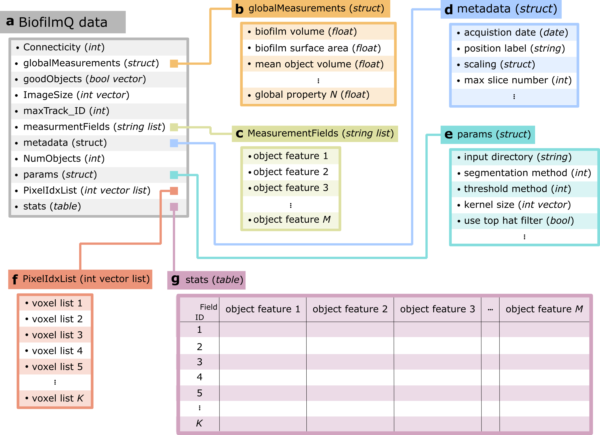

.. _data_export:

============
Data Export
============
.. raw:: html

	<iframe width="560" height="315" src="https://www.youtube.com/embed/9etbgANoj1k" frameborder="0" allow="accelerometer; autoplay; encrypted-media; gyroscope; picture-in-picture" allowfullscreen></iframe>

The tab :guilabel:`Data export` offers several options to export the results of the segmentation and parameter calculation to common file formats.

.. _export_visualization:

3D-Visualization (VTK) files
-----------------------------

`VTK <https://vtk.org/>`_ is a powerful 3D-file format for displaying and rendering 3D scientific data. For larger
surface renderings, the visualization tools provided by MATLAB do not provide the needed performance to interactively explore your datasets.
For the visualization of complex surface renderings including spatial distribution of objects parameters, we recommend `ParaView <https://www.paraview.org/>`_.

Because the segmentation is based on single voxels, the results of the segmentation have more edges than the microscope images suggest. To reduce the file size and 
produce more realistic surface renderings, you can use the checkbox :guilabel:`Reduce number of polygons by factor`.
In most cases the default value produces good results.

The option :guilabel:`Rotate biofilm` will modify the output orientation of the dataset.

In the dropdown menu :guilabel:`Output format` you can choose between :guilabel:`VTK (Paraview)` and :guilabel:`STL (3D-printing)`.
The STL format is useful for 3D-printing your segmented biofilm. Some 3D printing companies do not accept files with multiple object IDs. You can use the checkbox 
:guilabel:`Force one object ID only` to satisfy their requirements.

.. _export_fcs:

Flow Cytometry (FCS) files
-----------------------------

The Flow Cytometry Standard (FCS) is a `standardized <https://onlinelibrary.wiley.com/doi/full/10.1002/cyto.a.20825>`_ file
format for flow cytometry data. If you assume that all objects in your segmentation are *(pseudo-)cells*, and if each calculated object parameter is interpreted as a *(pseudo-)cell* cytometry parameter, 
you can create flow-cytometry-like datasets with BiofilmQ. All calculated properties can be visualized with a FCS-capable plotting program (e.g. FlowJo or many others).

.. warning::

	Due to constraints in the definition of the FCS format, only positive values will be saved. All negative values will be set to zero!

.. _export_csv:
	
Excel and CSV-files
------------------------------

You can export all object properties as well as the global biofilm parameters for further processing in a spreadsheet application of your 
choice (e.g. Microsoft Excel). BiofilmQ offers two types of spreadsheet export: 

- The :guilabel:`Export`-button exports the selected parameters for all objects to CSV-files. This is a text-file format which can be easily imported into the spreadsheet application. If your data contains a time series, for each frame of the time series, the export function saves a separate file in the subfolder ‘/data/txt_output’ inside your experiment folder. Additionally, it saves a summary file containing the global variables for every frame in the same folder.

-	The :guilabel:`Advanced export`-button allows you to export the global biofilm parameters for multiple time points and positions, all into one excel file. It requires a data structure in which the subfolders of your main experiment folder each contain the segmented time series data for one position. The workflow consists of the following steps: 
    
  #.	Select your main experiment folder in the file browser that opens after pressing the :guilabel:`Advanced export`-button.

  #.	In the export window that opens, select the parameters you want to export and their statistics (mean, standard deviation, etc.), when available. When a parameter offering different statistics is selected for export, but no statistic is selected, the default export is the mean. The tabs on the top of the parameter selection window allow you to select export parameters for different imaging channels at the same time.  

  #.	Specify the structure of the excel export file in the drop-down menus on the right. 
        **Example:** selecting ‘Position’ as column variables, ‘Variable’ as row variables and ‘Different sheets’ as export mode will result in an excel file in which each sheet contains the data for one of the time points, in form of a table with the parameter values for every position.

  #.	Press the :guilabel:`Export`-button. This will save the resulting excel file in the main experiment folder.

.. _export_mat:

Matlab MAT-files
-----------------

	

BiofimQ data structure. **a** For each time frame and for each channel a separate result file is generated which stores all information in a
single structure. Besides the required information to create a label image (i.e. *Connectivity*, *ImageSize*, *NumObjects*, and *PixelIdxList*)
it also contains information on the results of global biofilm measurements (*globalMeasurements*), information whether objects should be
excluded from the analysis (*goodObjects*), the maximal lineage ID (*maxTrack\_ID*), the names of the extracted object features
(*MeasurementsFields*), the acquisition metadata (*metadata*), the GUI parameters (*params*), and a table which contains for every
segmented object all values of the extracted features (*stats*). **b** *globalMeasurements* contain the information which is not
assigned to a single object, but rather to the full image stack. (i.e the volume or surface area of the imaged biofilm, or the mean
object volume for all objects inside the biofilm). **c** *MeasurementFields* contains the field names of all extracted features to
quickly check the availability of a certain feature without loading all results into RAM. **d** The metadata of the acquisition are
stored in the *metadata* structure (i.e. acquisition date, label for the current position, the information on the scale of a single
voxel, or the number of *z*-slices during the acquisition). **e** The GUI parameters are stored in the *params* structure. This
include all settings for all *BiofilmQ* modules. **f** The *PixelIdxList* contains for each object the index of the member voxels.
**g** The results of the parameter calculation are stored in *stats*. For each object ID the corresponding object features are stored. . Figure adapted from [`2 <https://doi.org/21.11101/0000-0007-E856-3>`_].
