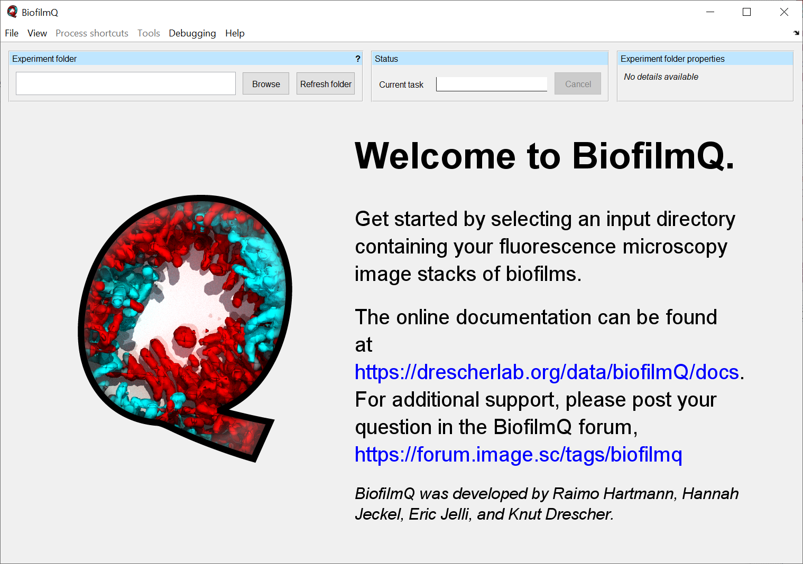
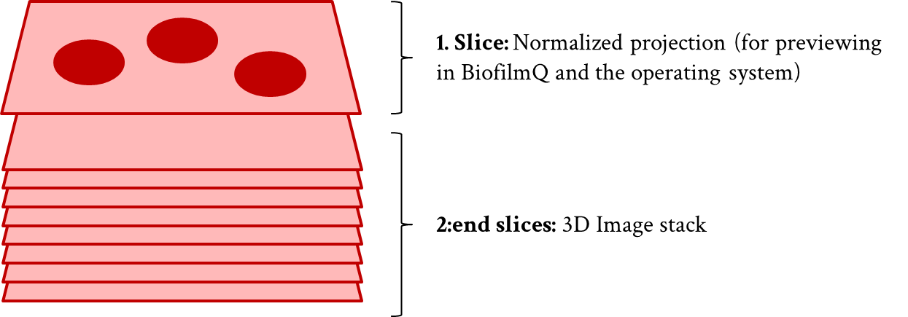
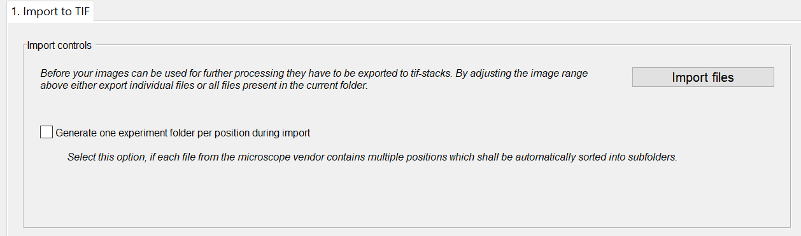
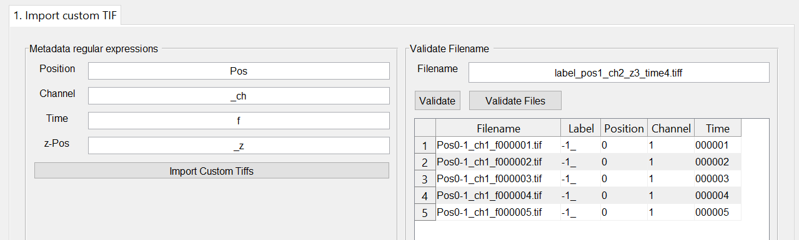

.. _file-input:

============
File Input
============

.. raw:: html

	<iframe width="560" height="315" src="https://www.youtube.com/embed/amNzczgsHDI" frameborder="0" allow="accelerometer; autoplay; encrypted-media; gyroscope; picture-in-picture" allowfullscreen></iframe>
	
.. raw:: html

	<iframe width="560" height="315" src="https://www.youtube.com/embed/0yECmC9tTkM" frameborder="0" allow="accelerometer; autoplay; encrypted-media; gyroscope; picture-in-picture" allowfullscreen></iframe>

After opening BiofilmQ, an empty BiofilmQ window is shown. BiofilmQ requires a directory (*Experiment folder*) containing your acquired microscope image stacks. The *Experiment folder* can be selected by using the :guilabel:`Browse`-button.

.. note:: During the folder selection no files will be shown.

	
There are several standard microscope file types which will be recognized by :program:`BiofilmQ`:

* Multiplane Tagged Image Files (.tif)
* OME-tiffs (.tiff)
* Numbered series of single-plane TIF images (.tif)
* Nikon NIS-Elements ND2 files (.nd2)
* Zeiss CZI files (.czi)
* Zeiss LSM (Laser Scanning Microscope) 510/710 files (.lsm)
* Leica LAS AF LIF (Leica Image File Format) files (.lif)
* Olympus FluoView FV1000 files (.oif or .oib)

In addition to that, 2D TIF files or 3D TIF stacks can also be converted to the internal format of BiofilmQ.

Quick Start
============

* After starting BiofilmQ use the button :guilabel:`Browse` in the :guilabel:`Experiment folder` panel. A file explorer window will pop-up and ask you to select the directory which contains the images you acquired with your microscope.
* If the directory does not contain TIF-z-stacks, then the :guilabel:`Import to TIF` tab appears. For details on the import of tif files, please refer to :ref:`load-tif-files`.
* The table in the *Files* panel lists all recognized microscope files in the selected directory.
* By using the :guilabel:`Import files` button you can import your files into BiofilmQ's own TIF format (:ref:`file-import-in-detail`). In most advanced microscope programs, you have the option to image multiple positions in one run. If you want to analyse each position individually, you can use the checkbox :guilabel:`Generate one experiment folder per position during export`. Each position can include a time series.
* If you used multiple fluorescence channels during the image acquisition, a pop-up will ask you to select the channel that contains the primary (e.g. constitutive) signal, on which the biofilm segmentation will be based. You can change the selection later if needed.
* If you created new directories for different biofilms in your images, at the end of the import process a pop-up window appears which asks you whether you want to switch to the first newly created directory.
* You can now proceed with the :ref:`image_alignment` (recommended for time series) or with the :ref:`segmentation`.

.. note:: In order to calculate biofilm properties with the correct dimensions, you must modify the values for *dxy* and *dz* scaling in the :guilabel:`Image preview` panel according to your imaging settings. Use the :guilabel:`Update all images` button to apply the settings to all images in the current folder.

.. _file-import-in-detail:

File import in detail
======================

BiofilmQ uses its own TIF-format (16bit multiplane TIF stacks, where the first plane is a scaled projection of the
whole stack to obtain nice image thumbnails e.g. inside Windows Explorer, and the
remaining planes in the multiplane TIF stacks are the actual z-stack). BiofilmQ
can convert the image formats listed above into its own TIF-format, as explained below. 

* BiofilmQ's TIF image format

The meta data of each stack are stored in .mat files with the same naming scheme used for the corresponding TIF-stack

.. code::

	<tif-file name>_metadata.mat

.. _load-non-tif-files:
	
Load standard microscope files
~~~~~~~~~~~~~~~~~~~~~~~~~~~~~~

For non-TIF files BiofilmQ automatically extracts metadata from the files themselves. BiofilmQ
detects the files based on the file extension. Once microscope files 
are detected, an import tab appears.

	
You can start the import of your files with the :guilabel:`Import to TIF`-button at the
bottom of the :guilabel:`Files` panel.
 
If you used several channels to capture different fluorescence signals, you have to select the principal signal channel (on which the segmentation will be based) in a pop-up message box.
 
You can change between the different file types by using the drop-down menu at the top of the *File* panel.
 
After a successful import, you can change to the newly created directories by using the pop-up window.

.. _load-tif-files:	
	
Load TIF files
~~~~~~~~~~~~~~~
	
Every TIF file which matches the naming scheme

.. code::

	*_frame*_Nz*.tif
	
is assumed to be in the correct BiofilmQ-internal TIF-format. If BiofilmQ detects TIF files without
the correct naming scheme, the files are assumed to be custom TIF files and the import tab for TIF
files appears.

	
In the tab you have the option to extract metadata from the file name. On the right-hand side you can define patterns which BiofilmQ
uses as start sequence for the metadata. All following digits are considered as the corresponding value.

You can test your current patterns on an arbitary filename in the field *filename* by pressing the button :guilabel:`Validate` on the
right-hand side.
If you want read the metadata from all files in the current *Experiment folder*, use the button :guilabel:`Validate Files`.

Once you pressed the button, the table below the button is filled. In case required metadata information can not be found, a warning message 
appears.
There, you have the option to fill the missing fields with a constant value. When the process is finished, you can also modify every single metadata cell
in the table manually.

To import all files according to the information stored in the table, press the button :guilabel:`Import Custom Tiffs`.

.. note::

    If you have multi-channel image data please start the the channel index *1* and increase the index one-by-one for each additional channel. Otherwise some BiofilmQ routines do not work as expected.
