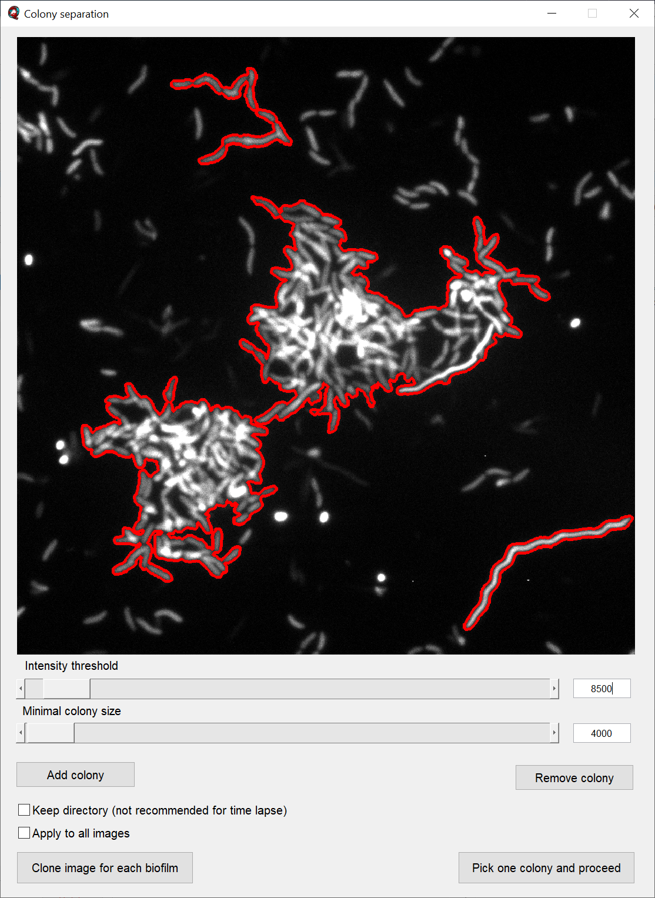

.. _image_preparation:

====================
Image Preparation
====================

The tab :guilabel:`1. Image preparation` on the right hand side of the user interface window is the
first step in most analysis pipelines
and offers options for 

* :ref:`image_series_curation`
* :ref:`colony_separation`
* :ref:`image_alignment`

.. _image_series_curation:

Image series curation
=======================
.. raw:: html 

	<iframe width="560" height="315" src="https://www.youtube.com/embed/m9KgHJNZs2E" frameborder="0" allow="accelerometer; autoplay; encrypted-media; gyroscope; picture-in-picture" allowfullscreen></iframe>

Find out-of-focus z-stacks
----------------------------
Probably everyone who has imaged biofilms over several hours might have experienced that
some frames in a time series are out of focus. If your imaging time interval is short enough, you can delete the out-of-focus frames and continue your analysis without major information loss.

To simplify the deletion, :program:`BiofilmQ` provides a semi-automated routine to delete the out-of-focus frames.

After clicking on the :guilabel:`Find out-of-focus stacks` button, the program calculates an *Intensity score*. For the score it uses the brightest plane and calculates the mean value of the brightest 100 pixels in this plane. The result is a value for each frame in the time lapse. On a confocal microscope out-of-focus frames have a significant lower brightness than the in-focus frames.

The *Intensity score* is presented in a pop-up figure once the calculation is finished. Use the left mouse button to select a lower threshold. All frames, which exhibit an *Intensity score* below this threshold will be deleted from the dataset. You have to confirm the deletion in a second pop-up message.

.. warning:: The deleted files will be removed from the directory *permanently*. If you are unsure, it is considered good-practice to work on a duplicated folder of the raw microscope data. 

.. _colony_separation:

Colony separation
=======================
.. raw:: html

	<iframe width="560" height="315" src="https://www.youtube.com/embed/YkfQwYv20Uw" frameborder="0" allow="accelerometer; autoplay; encrypted-media; gyroscope; picture-in-picture" allowfullscreen></iframe>
	
In some cases you want to analyse multiple biofilms in the same field of view (e.g. if you used a low
magnification there might be different biofilm colonies in the same z-stack). However, BiofilmQ can only analyse one time series
per experiment directory. In order to use BiofilmQ for all the biofilms in the same field of view, you have to duplicate
the frames of interest and change the region of interest (i.e. apply :ref:`cropping`) for each biofilm on its own.

The tab button :guilabel:`Separate colonies` in the tab :guilabel:`Colony separation` starts a semi-automated
tool which simplifies this process.

The main parameters of the colony separation process are set by the two sliders. The slider :guilabel:`Intensity threshold` selects colonies based on the measured pixel intensities; the slider :guilabel:`Minimal colony size` additionally excludes colonies below a certain colony size.

The button :guilabel:`Add Colony` allows you to draw a polygon which is included in the colony separation. Likewise, the button :guilabel:`Remove Colony` allows you to select an area with an polygon which is excluded from the colony separation.

.. note:: The drawn polygons are not conserved for slider changes. Therefore, we recommend to set a value for both sliders first and then define or exclude additional areas by using the polygon selection afterwards.

At the bottom of the Colony separation tool window you have two buttons: 

* :guilabel:`Clone image for each biofilm` creates a copy of the current folder for every colony, and applies the crop settings according to the bounding box of each selected colony.
* :guilabel:`Pick one and proceed` allows users to select a single colony with a crosshair and creates a single copy of the current folder, and applies the crop settings according to the bounding box of the selected colony.

If you want to apply the settings to all images in the current folder you have to enable the checkbox :guilabel:`Apply to all images`.

Now the complete folder is duplicated for each selected colony.

**Separate colonies for studying variations between biofilms (e.g. via a demograph):**

If you have a folder which contains images with multiple XY-positions, each of which
contains a field of view with several biofilms, you might be interested in a **demograph**
representation to visualize the differences between all biofilms in the current *Experiment folder*.
In this case you can enable the checkbox :guilabel:`Keep directory`.

If the checkbox :guilabel:`Keep directory` is enabled, the effects of the colony separation buttons have slightly changed:

* :guilabel:`Clone image for each biofilm` creates for every colony a new image file with the prefix *Colony<ID>_* with the corresponding crop settings.
* :guilabel:`Pick one and proceed` results in applying the bounding box of the selected colony to the current image file.

If this action is performed to generate data for a demograph, the effect of the :guilabel:`Clone image for each biofilm`
button renders the directory unusable for a time series analysis.
Therefore we added the small recommendation next to the checkbox.

If you want to apply the settings to all images in the current folder you have to enable the checkbox :guilabel:`Apply to all images`.

Now the complete folder is duplicated for each selected colony.

.. _image_alignment:

Image alignment
=======================
.. raw:: html

	<iframe width="560" height="315" src="https://www.youtube.com/embed/g3zSGuWvrfE" frameborder="0" allow="accelerometer; autoplay; encrypted-media; gyroscope; picture-in-picture" allowfullscreen></iframe>

If you have captured multiple images in a time series, you probably noticed that your samples
can drift over time in :math:`x` and :math:`y``-direction. If you want to compare spatial
information (like biofilm positions or pseudo-cell cube position) or track segmented objects,
you have to correct the sample drift before you segment your images.

For this purpose we have included the :guilabel:`Image alignment` tab in BiofilmQ.

:guilabel:`Reference frame` defines the zero position of the alignment. All other
positions are stored with respect to the reference frame. The button :guilabel:`Set current frame`
will use the currently selected image in the :guilabel:`Files`-panel as reference frame.

In our lab we always use the last position of a time series as a reference frame.
In some experiments you will observe a fully developed biofilm which covers the entire field of view in the final frame. In the first frame however, only a small number of cells are visible. Using the first frame as reference frame will likely 
lead to a displaced of the biofilm in the final frame. This small displacement can push the biofilm
out the field of view, unless the last image in teh time series is chosen as the reference frame.

By enabling the checkbox :guilabel:`Continue existing registration`, the reference frame is not assigned as zero position but rather uses its already aligned position. If no value has been assigned yet, an error message will be shown.
We implemented two registration methods. :guilabel:`Mean squares` uses the default `MATLAB <https://de.mathworks.com/help/images/ref/imregtform.html>`_  image registration method. :guilabel:`Correlation` will use a correlation-based approach by `Guizar-Sicairos et al. (2008) <https://www.osapublishing.org/ol/viewmedia.cfm?uri=ol-33-2-156&seq=0>`_.

For well-focused images the correlation-based approach is very robust even for large displacements. The mean squares approach works for small drifts with not perfectly-focused images.

If you captured 3D image stack time series, you probably also experience a drift in the :math:`z` direction. You can use the checkbox :guilabel:`Align also along z`, to minimize this drift as well. This function exclusively uses the correlation-based approach mentioned above.

After the image alignment you can proceed with the :ref:`segmentation` of your input data.