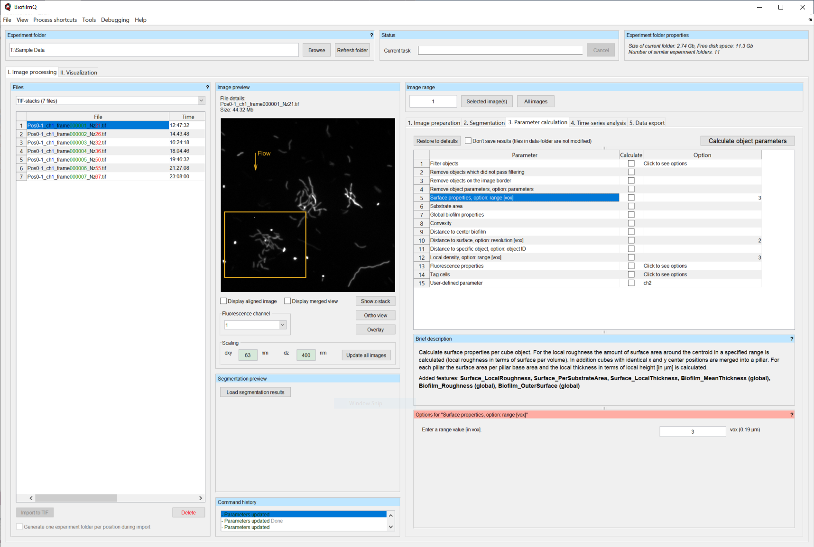
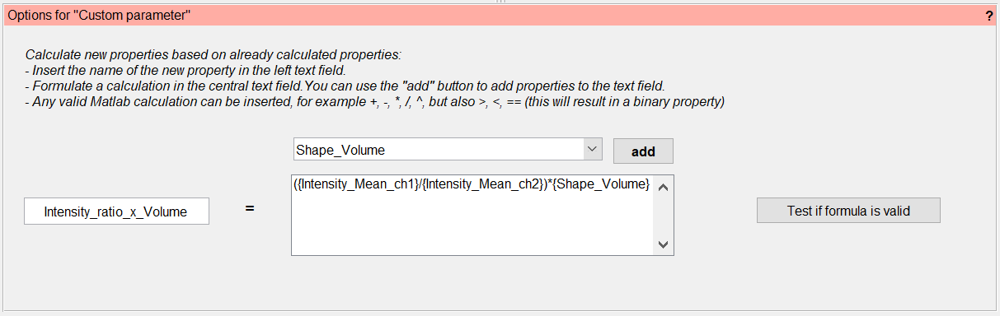

.. _cell_parameter_calculation:

====================================
Parameter Calculation
====================================
.. raw:: html

	<iframe width="560" height="315" src="https://www.youtube.com/embed/GqVr_G95VSY" frameborder="0" allow="accelerometer; autoplay; encrypted-media; gyroscope; picture-in-picture" allowfullscreen></iframe>

In the tab :guilabel:`Parameter calculation` you can compute additional measurements or features which can be extracted from image stacks
for the whole biovolume, or for each pseudo-cell cube in the biovolume.

.. note::
	
	The `segmentation <./segmentation.html>`_ extracts the following parameters for each pseudo-cell cube (also called "object" below) by default:

	* **CentroidCoordinate_{x, y, z}**.  Center coordinate in :math:`x, y, z` direction.
	* **Shape_Volume**.  Volume in :math:`\mu m^3`.
	* **Intensity_Mean**.  (Option: fluorescence channel on which the segmentation is based) 	Mean of all fluorescent intensity values.
	* **Cube_VolumeFraction**.  Ratio of occupied biovolume of the cube compared to the total cube volume.	
	* **Cube_Surface**.  Number of interface voxels between occupied and unoccupied volume in cube.
	* **Cube_CenterCoord**.  This is an internal property only. Center coordinate of cube.
	* **Grid_ID**.  Unique ID of grid position within the given volume (depends only on x, y, and z). Two cubes of different z-stacks at the same position will have the same Grid_ID.
	* **ID**.  Unique object ID.

By selecting a row in the parameter calculation table, you toggle a description panel underneath the table. In this description, you will find brief information on the calculation process, 
the added features and if particular preprocessing steps are required.

If the calculation of a specific measurement depends on certain input parameters, a second panel will appear below the parameter calculation table,
with the possibility to provide these parameters.

If you want to test a calculation (especially for debugging) without overwriting the already calculated results you can use the checkbox :guilabel:`Don't save results`.
Use the button :guilabel:`Calculate object parameters` to start the calculation of all ticked properties. With the button :guilabel:`Restore to defaults` you can reset all custom options.

We will now describe the different parameters that can be calculated. You can include them in the next calculation process by enabling the checkbox 
in the column :guilabel:`Calculate`.

Filter parameters
-----------------------

The execution of the first tasks in the list does not directly result in any object parameters. Here you will find useful tools to remove or
exclude objects with certain properties from the overall biovolume.

.. _filter_objects:

Filter objects
~~~~~~~~~~~~~~~

Exclude objects from further calculations which are outside
the specified range of a given parameter (e.g. to exclude very small objects, or objects at a particular location).

Of course, the objects can only be filtered accordinig to parameters that have already been calculated at this stage of in the processing pipeline.
So you may have to run the parameter 
calculation at least twice. Each filter range is defined on a per-file basis. Use the button :guilabel:`Determine` for a graphical range selection. Use the button :guilabel:`Set for all` if you want to 
use the same range on all files in the *Files* panel. After filtering, objects outside the parameter range are excluded from further analysis, but are not permanently deleted. To undo a filtering operation simply filter again with a data range including all objects. 
For filtering by several parameters you have to remove objects which did not pass filtering after each filtering step.

.. note::
    
    More advanced filtering can be done in the data visualization mode of BiofilmQ. The filtering option in the parameter calculation is intended for actually removing objects from your dataset. To apply more complex filtering rules, use the `tag cells <#id7>`_ task and filter based in the tagging afterwards.

Remove objects which did not pass filtering
~~~~~~~~~~~~~~~~~~~~~~~~~~~~~~~~~~~~~~~~~~~~~~

Permanently deletes all objects which are excluded from parameter calculation by prior filtering.

Remove objects on the image border
~~~~~~~~~~~~~~~~~~~~~~~~~~~~~~~~~~

Permanently delete all objects which overlap with the image border or crop rectangle.

Remove object parameters
~~~~~~~~~~~~~~~~~~~~~~~~~
Permanently delete all specified object parameters.

One (or multiple comma-separated) parameters can be defined in the :guilabel:`Options` panel for removal. You can find a list of all already calculated parameters in the :guilabel:`Data export` tab.

Object parameters
----------------------

In this section we will discuss all available object parameter calculation tasks. Parameters starting with *Biofilm_* are global parameters and are calculated for the whole 
biofilm once. All other parameters are calculated for each object separately.

Some parameters can be calculated with different options, such as different
fluorescence channels, different range options or resolutions.

To keep track of these parameters, each one is appended to the parameter name for
the visualization or data export. For example the note *"Option: channel"* for the parameter *Intensity_Mean* leads to a parameter name *Intensity_Mean_chX*
where *X* is replaced by the picked channel number for the calculation.

Surface properties
~~~~~~~~~~~~~~~~~~~~

All objects with the same :math:`x,y` center coordinates are grouped to a 'pillar'. For each 'pillar' the surface is calculated.

The option *range* (in :math:`\mu m`) defines the radius of a sphere around the *CentroidCoordinate* of each object for the calculation of *Surface_LocalRoughness*.

* **Surface_LocalRoughness**.  (Option: *range*) Number of interface voxels between occupied and unoccupied volume in a sphere with radius *range* around *CentroidCoordinate* of each object (in other words, this paramter quantifies "surface density, or amount of surface area in a given volume").

* **Surface_PerSubstrateArea**.  Each object in the pillar gets assigned the number of the pillar interface voxels divided  by the pillar base area. The base area is identical to the squared grid size. This parameter has the same value for every pseudo-cell cube in the same "pillar" of the biofilm.
  
* **Surface_LocalThickness**.  For each pillar the highest :math:`z` value for each base pixel is calculated, the *Surface_LocalThickness* is the mean value of all :math:`z` values in :math:`\mu m`. This parameter has the same value for every pseudo-cell cube in the same "pillar" of the biofilm.

* **Biofilm_MeanThickness**.  (global) Mean value of *Surface_LocalThickness*. This paramter has one value for the entire biofilm biovolume.
  
* **Biofilm_Roughness**.  (global)  Defined as :math:`\frac{mean(d)}{N} \cdot \sum_i^N  |mean(d) - d_i|`, with :math:`N` denoting the total number of pillars, :math:`d_i` the thickness  of pillar :math:`i`.

* **Biofilm_OuterSurface**.  (global) is the sum of all pillar surfaces (including holes).

.. note::
    
    These "Surface properties" parameters only work for biofilms that have been dissected into cubes.

Substrate area
~~~~~~~~~~~~~~~

To calculate the substrate area, the intersection between the segmentation results and the defined substrate plane is calculated. You can insert the index of the substrate plane of the z-stack in the options panel. This limits the choice of the substrate plane to the available :math:`xy` planes. If no input is given, the brightest plane in the z-stack is assumed to be the substrate plane.

.. note::

	You can use the button :guilabel:`ortho view` in the :guilabel:`Image preview` panel to scroll through your image stack.

* **Architecture_LocalSubstrateArea**.  Number of voxels of each cube which are intersecting the given substrate plane.

* **Biofilm_SubstrateArea**.  (global) Sum of all plane intersections in :math:`\mu m^2` for the whole biofilm.

Global biofilm properties
~~~~~~~~~~~~~~~~~~~~~~~~~~~~~~

The *global biofilm properties* module calculates shape-related biofilm properties. Some require an approximation of the 2D footprint of the biofilm at the substrate (base shape). 
This is done by calculating the `convex hull <https://en.wikipedia.org/wiki/Convex_hull>`_ 
of the :math:`x` and :math:`y` coordinate of each detected object.
To minimize the effect of single objects which are not part of the bulk biofilm, only objects within the
1% - 99% percentile range in :math:`x` direction, 1% - 99% percentile range in the :math:`y` direction, and 1% - 99.5% percentile range
in :math:`z` direction are used. The :math:`z` direction is additionally corrected by subtracting the 1% percentile value
from the remaining object coordinates.

If there are more than 5 cubes objects at the biofilm base, the base shape is approximated by fitting an ellipse
into the convex hull.

* **Biofilm_Width**.  (global) Sub axis of the :math:`x` axis of the non-tilted ellipse in :math:`\mu m` (0 if less than 5 cube objects at the biofilm base).
 
* **Biofilm_Length**.  (global) Sub axis of the :math:`y` axis of the non-tilted ellipse in :math:`\mu m` (0 if less than 5 cube objects at the biofilm base).
 
* **Biofilm_Height**.  (global) Measure of the height within the [1%, 99%] range of :math:`z` coordinates in :math:`\mu m`.
 
* **Biofilm_BaseEccentricity**.  (global) Eccentricity of the fitted ellipse (1 if less than 5 cube objects at the biofilm base).
 
* **Biofilm_BaseArea**.  (global) Area of the fitted ellipse in :math:`\mu m^2` (Area of the convex hull if less than 5 cube objects at the biofilm base).
 
* **Biofilm_Volume**.  (global) Sum of the detected biovolume of all cubes during segmentation in :math:`\mu m^3`.

* **Biofilm_AspectRatio_HeightToWidth**.  (global) Defined as *Biofilm_Height*/*Biofilm_Width*.

* **Biofilm_AspectRatio_HeightToLength**.  (global) Defined as *Biofilm_Height*/*Biofilm_Length*.

* **Biofilm_AspectRatio_LengthToWidth**.  (global) Defined as *Biofilm_Length*/*Biofilm_Width*.

* **Biofilm_OuterSurfacePerSubstrate**.  (global) Defined as *Biofilm_OuterSurface*/*Biofilm_SubstrateArea* (or *Biofilm_OuterSurface*/*Biofilm_BaseArea* if *Biofilm_SubstrateArea* has not be calculated; *NaN* if *Biofilm_OuterSurface* does not exist).

* **Biofilm_OuterSurfacePerVolume**.  (global) Defined as *Biofilm_OuterSurface*/*Biofilm_Volume* (*NaN* if *Biofilm_OuterSurface* does not exist).

* **Biofilm_VolumePerSubstrate**.  (global) Defined as *Biofilm_Volume*/*Biofilm_SubstrateArea* (*Biofilm_Volume*/ *Biofilm_BaseArea* of *Biofilm_SubstrateArea* has not be calculated).

Convexity
~~~~~~~~~~~~~~~~~~~~~~~~~~~~~

* **Shape_Convexity**.  Volume of convex hull of each object divided by  the biovolume of each object. This parameter is calculated for each pseudo-cell cube of the biofilm.

.. note::
    This property is also available for single cell segmentation.

Distance to center of biofilm
~~~~~~~~~~~~~~~~~~~~~~~~~~~~~~~

Calculates the center of the whole biofilm biovolume by taking the mean value over the *CentroidCoordinates* of all objects (excluding the ones filtered out by :ref:`filter_objects`).

* **Distance_ToBiofilmCenter**.  Distance of each object *CentroidCoordinate* to the center of the biofilm in :math:`\mu m`.

* **Distance_ToBiofilmCenterAtSubstrate**.  Same as *Distance_ToBiofilmCenter* but uses the minimal value in :math:`z` of the whole biofilm instead of the mean. This is the distance of each object to the center of the biofilm projected down to the substrate plane.

.. note::
    This property is also available for single cell segmentation.

.. _distance_to_surface:

Distance to surface
~~~~~~~~~~~~~~~~~~~~

The surface of the biofilm is approximated as a custom convex hull, which is calculated as follows. To calculate the convex hull, a mesh with a custom *resolution* is generate in
the :math:`xy` plane. For each mesh point a circular pillar with the radius *resolution* is generated. The highest :math:`z` centroid value of all objects within this pillar
is used as a :math:`z` coordinate for the convex hull.

* **Distance_ToSurface**.  (Option: *resolution*) Distance between cube object centroid to the outer convex hull. 

.. note::
    This property is also available for single cell segmentation.

Distance to specific object
~~~~~~~~~~~~~~~~~~~~~~~~~~~~

The option *ID* indicates the object of interest, to which the distance of all other objects is calculated.

* **Distance_ToObject**.  (Option: ID) The distance of the object centroid to the centroid of the object with the provided *ID* in :math:`\mu m`.

.. note::

 To figure out the ID of a certain object visualize the biofilm in ParaView and color the objects by their ID.

.. note::
    This property is also available for single cell segmentation.
 

Local density
~~~~~~~~~~~~~~~~

To compute measures of the local density, BiofilmQ calculates a sphere with radius *range* in :math:`\mu m` around each object *CentroidCoordinates*.
	
* **Architecture_LocalNumberDensity**.  (Option: *range*) Number of other object *CentroidCoordinates* within the sphere.

* **Architecture_LocalDensity**.  (Option: *range*) Occupied volume fraction in the sphere (results in NaN if calculation is not possible).

.. note::
    This property is also available for single cell segmentation.

Properties for single-cell segmentation
---------------------------------------
The following properties are only well defined when using single-cell segmentation that has been imported into BiofilmQ as explained in :ref:`segmentation_import`.

Size, aspect ratio and orientation
~~~~~~~~~~~~~~~~~~~~~~~~~~~~~~~~~~~~~~~~~~~~~~~~~~~~~~

Each cell is fitted by an ellipsoid to give the width, height and length of each cell. From these, two aspect ratios are calculated. Furthermore, the orientation of the ellipsoid is available.

* **Shape_Width**.  Length of shortest axis of ellipsoid in :math:`\mu m`.
* **Shape_Height**.  Length of second longest axis of ellipsoid in :math:`\mu m`.
* **Shape_Length**.  Length of the longest axis of ellipsoid in :math:`\mu m`.
* **Shape_AspectRatio_LengthToWidth**.  Ratio between `Shape_Length` and `Shape_Width`.
* **Shape_AspectRatio_HeightToWidth**.  Ratio between `Shape_Height` and `Shape_Width`.

..
    This is a comment. Orientation_Matrix seems not to be implemented currently...
    * **Orientation_Matrix**. Matrix describing the three dimensional orientation of ellipsoid.

Distance to nearest neighbor
~~~~~~~~~~~~~~~~~~~~~~~~~~~~

For each cell, this property calculates the distance in :math:`\mu m` to the nearest neighbor. The option `channel` is set to `1` by default. This means that the nearest cell based on the segmentation present in channel `1` is used. By changing this option, you can also calculate the distance to the nearest cell of another channel.

* **Distance_ToNearestNeighbor**.  (Option: *channel*) Centroid-to-centroid distance to nearest neighbor in :math:`\mu m`.

Inter-cell-spacing
~~~~~~~~~~~~~~~~~~

By ray tracing, this property quantifies the boundary-to-boundary distances from each cell to neighboring cells that are within a certain distance defined by the option `screening range [vox]`.

* **Distance_InterCellSpacing_Mean**.  (Option: *screening range [vox]*) The mean of all boundary-to-boundary distances in :math:`\mu m`.
* **Distance_InterCellSpacing_Min**.  (Option: *screening range [vox]*) The minimum of all boundary-to-boundary distances in :math:`\mu m`.
* **Distance_InterCellSpacing_Variance**.  (Option: *screening range [vox]*) The variance of all boundary-to-boundary distances in :math:`\mu m^2`.

Alignments and nematic order parameter
~~~~~~~~~~~~~~~~~~~~~~~~~~~~~~~~~~~~~~

With this, the alignment of the principal axis of each cell with various axes is calculated. Furthermore, the nematic order in relation to neighboring cells (based on option `range [vox]`) is calculated.

* **Alignment_Zaxis**.  Alignment of principal axis with the *z*-axis in :math:`rad`.
* **Alignment_Zaxis**.  Alignment of principal axis with the axis pointing in flow direction in :math:`rad`.
* **Alignment_Radial**.  Alignment of principal axis with the axis pointing towards the biofilm center in :math:`rad`.
* **Architecture_NematicOrderParameter**.  (Option: *range [vox]*) Measurement of alignment with those neighboring cells that are within distance as defined by *range*.

Fluorescence properties
------------------------
.. raw:: html

	<iframe width="560" height="315" src="https://www.youtube.com/embed/HyMbjmJmx7I" frameborder="0" allow="accelerometer; autoplay; encrypted-media; gyroscope; picture-in-picture" allowfullscreen></iframe>

This module applies again all filters used for the :ref:`segmentation` on the raw image stacks (noise removal is optional).
Based on the filtered/ cropped/ isotropical-pixel-spacing-transformed images the user can calculate the fluorescence
properties listed below. The properties can be categorized into two major categories:

* :ref:`intensity_properties`
* :ref:`correlation_properties`

..
    * :ref:`haralick_features`

Use the :guilabel:`Options` panel to create a custom processing pipeline by adding desired calculation tasks. You can find each calculation task in the
drop-down menu on the right. As soon as you have selected a task, you can modify the task-related options via the interface elements below.

Use the :guilabel:`Add` button to append the task to the pipeline. With the buttons :guilabel:`Delete entry` or :guilabel:`Clear` you can remove a selected entry from the list
or reset the whole selection.

.. _intensity_properties:

Intensity Properties
~~~~~~~~~~~~~~~~~~~~~~~~

The background value is defined as the lowest 30% of fluorescence pixel values in the entire image stack. Every fluorescence
intensity-related task needs the *channel* number as argument, to indicate to BiofilmQ which fluorescence channel be used.
The ratio measurements compare the intensity ratios, which can be useful to compare specific reporter expression levels
with constitutive signals.

With the shell-related parameters, the fluorescence signal inside a shell around each object can be quantified.
The shell is constructed by expanding each object by a layer of thickness *range*. Then the average or integrated intensity of all voxels inside this shell is 
calculated. For cubed biofilms inter-cube faces are not considered for the shell calculation.
These shell-related parameters are particularly useful for quantifying the signal of extra-cellular components
labeled with fluorescent dyes.

* **Intensity_Mean**.  (Option: *channel*) Average of all pixel intensity values for all cube object voxels.

* **Intensity_Mean_noBackground**.  (Option: *channel*) Same as *Intensity_Mean* but prior to calculation the background intensity is subtracted.

* **Intensity_Integrated**.  (Option: *channel*) Sum of all intensity values per cube object.

* **Intensity_Integrated_noBackground**.  (Option: *channel*)  Same as *Intensity_Integrated* but prior to calculation the background intensity is subtracted.

* **Intensity_Ratio_Mean**.  (Options: *channelA*, *channelB*)  Mean ratio of the intensity values per cube object in *channelB* and *channelA*.

* **Intensity_Ratio_Mean_noBackground**.  (Options: *channelA*, *channelB*) Like *Intensity_Ratio* but prior to calculation the background intensity values are subtracted for each channel.

* **Intensity_Ratio_Integrated**.  (Options: *channelA*, *channelB*) Same as *Intensity_Ratio_Mean* but with the integrated intensities.

* **Intensity_Ratio_Integrated_noBackground**.  (Options: *channelA*, *channelB*) Same as *Intensity_Ratio_Mean_noBackground* but with the integrated intensities.

* **Intensity_Shells_Mean**.  (Options: *channel*, *range*) Like *Intensity_Mean* but for all voxels inside the shell defined by the radius given by the parameter *range*.

* **Intensity_Shells_noBackground**.  (Options: *channel*, *range*)  Like *Intensity_Mean_noBackground* but for all voxels inside the shell defined by *range*.

* **Intensity_Shells_Integrated**.  (Options: *channel*, *range*) Like *Intensity_Integrated* but for all voxels inside the shell defined by *range*.

* **Intensity_Shells_Integrated_noBackground**.  (Options: *channel*, *range*) Like *Intensity_Integrated_noBackground* but for all voxels inside the shell defined by *range*.

The task *Visualize extracellular fluorophores* creates vtk files in the data subfolder which can be used to `visuallize <https://cdn-az.allevents.in/banners/000676c0-93fe-11e8-81c9-1b431fd718bc-rimg-w1200-h995-dce2e4e5-gmir.jpg>`_ the intensity values of the shell-based
calculations in ParaView.

.. _correlation_properties:

Correlation Properties
~~~~~~~~~~~~~~~~~~~~~~~~~

Some fluorescence correlation properties can be calculated for every single object as well as for the full 3D image z-stack.

* **Correlation_Pearson**.  (Options: *channelA*, *channelB*, *range*) (global/ local) The `Pearson's correlation coefficient <https://en.wikipedia.org/wiki/Pearson_correlation_coefficient>`_ of two channels. Can be calculated either per object or for the full 3D image z-stack.

* **Correlation_Manders**.  (Options: *channelA*, *channelB*, *range*) (global/ local) The `Manders' overlap coefficient <https://doi.org/10.1111/j.1365-2818.1993.tb03313.x>`_ of two channel. Can be calculated either per object or for the full stack.

    * **Correlation_MandersSplit_<channelA>_<channelB>**.  (Options: *channelA*, *channelB*, *range*) (global/ local) The `Manders' split coefficient <https://doi.org/10.1111/j.1365-2818.1993.tb03313.x>`_ of one channel in the other. Can be calculated either per object or for the full stack.

    * **Correlation_MandersSplit_<channelB>_<channelA>**.  (Options: *channelA*, *channelB*, *range*) (global/ local) Like *Correlation_MandersSplit_<channelA>_<channelB>* but with swapped channel definitions.

* **Correlation_AutoCorrelation_CorrelationFcn**.  (Options: *channel*) (global) Calculates the autocorrelation function in 3D for the full image.

    * **Correlation_AutoCorrelation_CorrelationLength2D_ch%d**.  (Option: *channel*) (global) 2D correlation length (distance where the autocorrelation has dropped by 50%) as determined from the average 2D autocorrelation functions for each plane of the image stack.

    * **Correlation_AutoCorrelation_CorrelationLength2D_Subtrate**.  (Option: *channel*) (global) 2D correlation length determined from the autocorrelation function at the brightest plane of the biofilms.

    * **Correlation_AutoCorrelation_CorrelationLength3D**.  (Option: *channel*) (global) 3D correlation length (distance where the autocorrelation has dropped by 50%) as determined in 3D for the whole image stack.

    * **Correlation_AutoCorrelation_Zero3D**.  (Option: *channel*) (global) (global) Position of the first zero-crossing of the 3D autocorrelation function.

    * **Correlation_AutoCorrelation_Zero2D**.  (Option: *channel*) (global) (global) Position of the first zero-crossing of the averaged 2D autocorrelation functions for each plane of the image stack.

    * **Correlation_AutoCorrelation_Zero2D_Substrate**.  (Option *channel)* Like *Correlation_AutoCorrelation_Zero2D* only in the substrate plane.

* **Correlation_DensityCorrelation**.  (Options: *channelA*, *channelB*, *range*) The density correlation for each object :math:`C = \frac{\sum^N_i a_i \cdot \sum^M_j b_j}{N^2}`, where :math:`a_i, b_j` denotes all pixel values of *channelA*, *channelB* in a box with edge length 2x *range* around the objects centroid, respectively.

* **Correlation_DensityCorrelation_Binary**.  (Options: *channelA*, *channelA*, *range*) The *Correlation_DensityCorrelation* on the binary image which resulted from the segmentation.

    .. note::
        
        The density correlation task requires a data file containing data merged from two channels. Segmented biofilms in two different channels can be merged with the post-processing option merge channels in the `Segmentation` tab (see :ref:`transfer_segmentation`).

* **Correlation_Local3dOverlap**.  (Options: *channelA*, *channelB*) The volume overlap in :math:`\mu m^3` of each object in *channelA* with all segmented objects in *channelB*.

* **Correlation_LocalOverlapFraction**.  (Options: *channelA*, *channelB*) Like *Correlation_Local3dOverlap* divided by the objects volume.

* **Biofilm_Overlap**.  (Options: *channelA*, *channelB*) (global) The sum of *Correlation_Local3dOverlap* for all objects in *channelA*.

* **Biofilm_OverlapFraction**.  (Options: *channelA*, *channelB*) (global) The sum of *Correlation_LocalOverlapFraction* for all objects in *channelA*.

..
    .. _haralick_features:

    Haralick texture features
    ~~~~~~~~~~~~~~~~~~~~~~~~~~

    Currently only the mean of the `Haralick features <https://www.researchgate.net/publication/234812081_3D_extension_of_Haralick_texture_features_for_medical_image_analysis>`_ in the directions up, down, right, left, back, forth in the given *channel* and *range* are calculated.
    The Haralick features are based on the entities of the `co-occurrence matrix <https://en.wikipedia.org/wiki/Co-occurrence_matrix>`_
    :math:`p_{i,j}`. Additionally the properties: 

    * :math:`\mu_x = \sum_{i,j} i\cdot p_{i,j}`, 

    * :math:`\mu_y = \sum_{i,j} j \cdot p_{i,j}`,

    * :math:`\sigma_x = \sum_{i,j} (i-\mu_x)^2 \cdot p_{i,j}`, 

    * :math:`\sigma_y = \sum_{i,j} (j-\mu_y)^2 \cdot p_{i,j}`

    are used for the calculation.

    * **Texture_Haralick_Energy**.  (Options: *channel*, *range*) Defined as :math:`\sum_{i,j} p_{i,j}^2`.

    * **Texture_Haralick_Entropy**.  (Options: *channel*, *range*) Defined as  :math:`\sum_{i,j} p_{i,j}\cdot \log_{10}(p_{i,j})`.

    * **Texture_Haralick_Correlation**.  (Options: *channel*, *range*) Defined as  :math:`\sum_{i,j} ((i-\mu_x)*(j-\mu_y)*(p_{i,j}/(\sigma_y*\sigma_x)))`.

    * **Texture_Haralick_Contrast**.  (Options: *channel*, *range*) Defined as  :math:`\sum_{i,j} p_{i,j} \cdot |i-j|^2`.

    * **Texture_Haralick_Homogeneity**.  (Options: *channel*, *range*) Defined as  :math:`\sum_{i,j} \frac{p_{i,j}}{1+|1-j|}`.

    * **Texture_Haralick_Variance**.  (Options: *channel*, *range*) Defined as  :math:`\sum_{i,j} (i-\mu_x)^2 \cdot p_{i,j} +  (j-\mu_y)^2 \cdot p_{i,j}`.

    * **Texture_Haralick_SumMean**.  (Options: *channel*, *range*) Defined as  :math:`\sum_{i,j} (i+j) \cdot p_{i,j}`.

    * **Texture_Haralick_Inertia**.  (Options: *channel*, *range*) Defined as   :math:`\sum_{i,j} (i-j)^2 \cdot p_{i,j}`.

    * **Texture_Haralick_ClusterShade**.  (Options: *channel*, *range*) Defined as  :math:`\sum_{i,j} (i+j-\mu_x - \mu_y)^3 \cdot p_{i,j}`.

    * **Texture_Haralick_ClusterTendency**.  (Options: *channel*, *range*) Defined as  :math:`\sum_{i,j} (i+j-\mu_x - \mu_y)^4 \cdot p_{i,j}`.

    * **Texture_Haralick_MaxProbability**.  (Options: *channel*, *range*) Defined as  :math:`\max_{i,j} p_{i,j}`.

    * **Texture_Haralick_InverseVariance**.  (Options: *channel*, *range*) Defined as  :math:`\frac{p_{i,j}}{(i-j)^2}`.

Tag cells
------------------------
Sometimes (especially for the analysis or visualization of the experiment) it becomes useful to tag a subset
of the observed cube objects based on the already calculated parameters. In contrast to *filter objects*, this
function will add a new parameter for each new tag. All objects are still processed by the other parameter calculations in the same way.

* **<user_defined_name>**.  (requires: parameter for tagging, rules) stores for each object the value 1 (true) if all filter rules are fulfilled otherwise it stores 0 (false)

Custom parameter 
--------------------
This calculation allows to directly define a new property derived from already calculated properties by using standard operations such as `+, -, *, /, ^` or even `>, <, ==`. 
Any number of properties can be combined into an expression that is then evaluated to obtain the new property. Users can choose the name of this new property freely, such that the 
functionality can even be used to overwrite and correct existing properties. Properties used in the formula can be chosen from a drop-down menu that displays all available properties or manually added within 
curved brackets.
A button is available to test the semantic correctness of the formula prior to actual parameter calculation.

Users should keep in mind that only already calculated properties are available for use in this step, which may make it necessary to run the parameter calculation multiple times.

* **User-defined parameter**.  

	
	
User-defined property by Matlab script
---------------------------------------
This functionalities enables the user to calculate completely new properties or derived properties freely by applying a Matlab script to the objects. This extends the previously mentioned
custom parameter in the sense that not only standard operations, but any Matlab-based calculation can be performed. In the default file 
(located at the file path: includes/object processing/actions/template.m in the BiofilmQ source files) you can find a short overview of
the accessible variables during runtime and a description for how to save custom parameters in the objects variable.

* **User-defined parameter**.  

