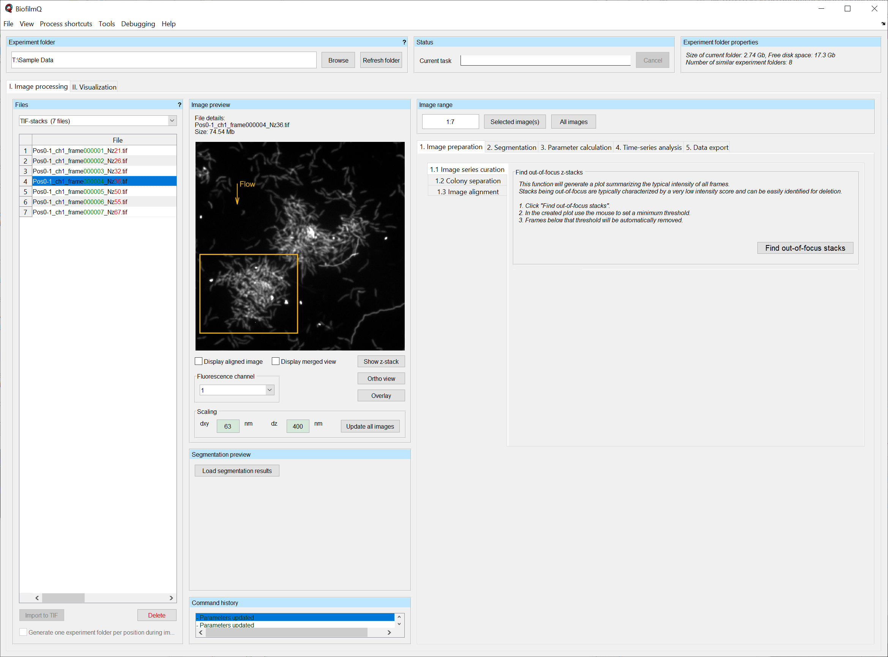
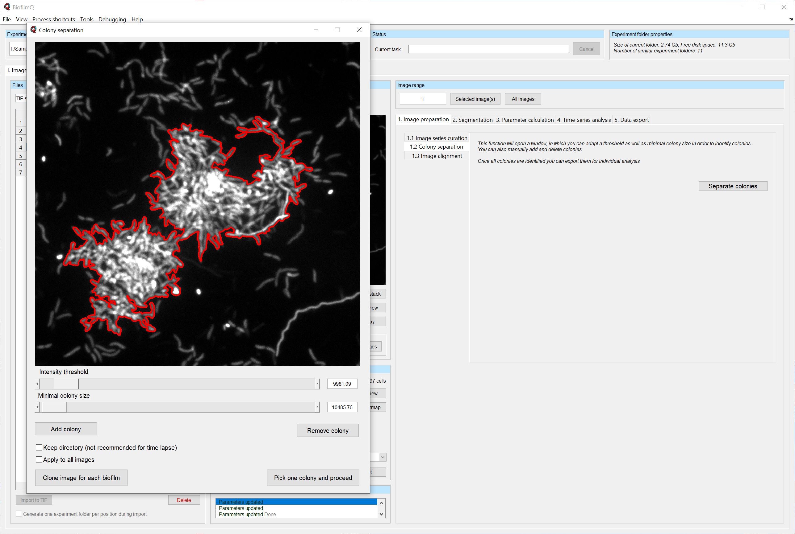
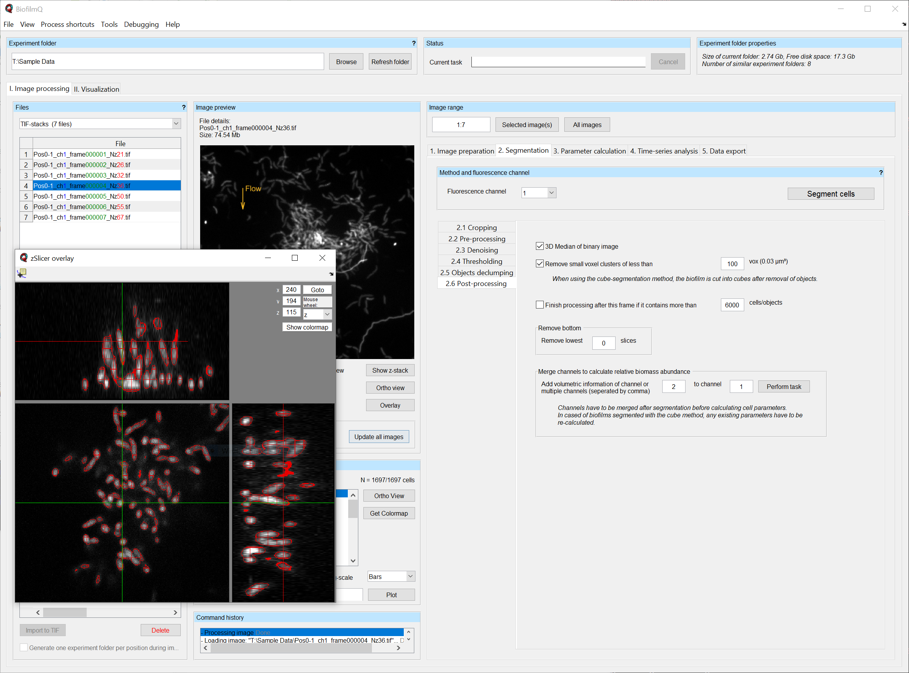
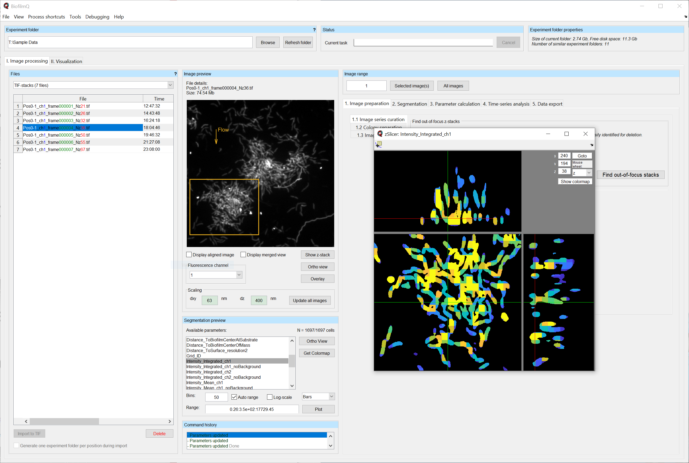
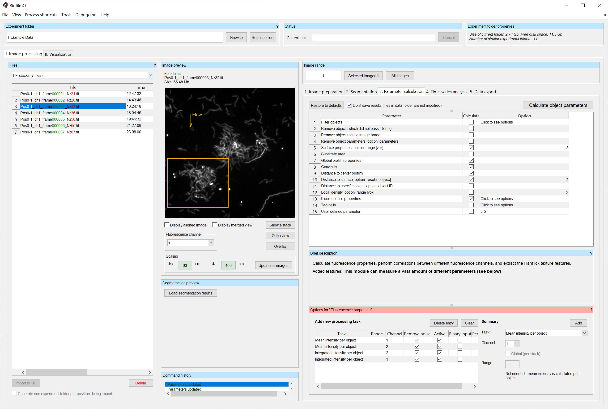
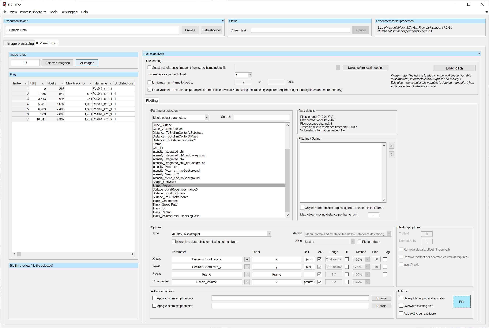
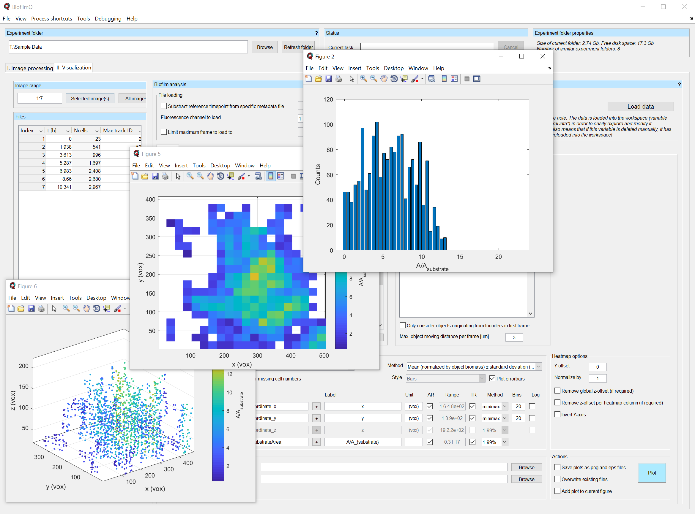

==========================================
Screenshots
==========================================

File-input panel
###################

   

Colony separation
###################

   

  

BiofilmQ segmentation panel
#############################

   
BiofilmQ segmentation preview
#############################

  
  
Parameter calculation
######################

   

  
Visualization panel
############################

  

   