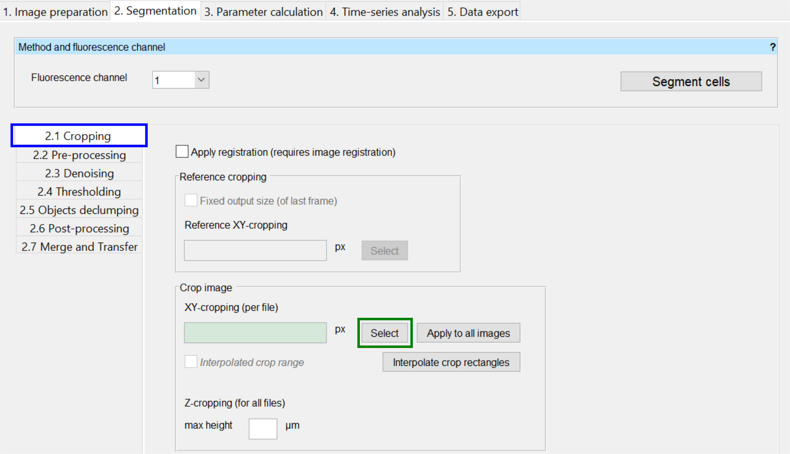
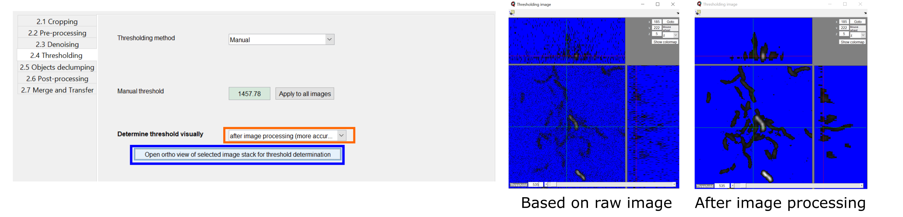
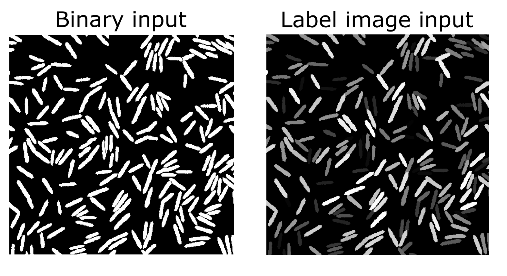
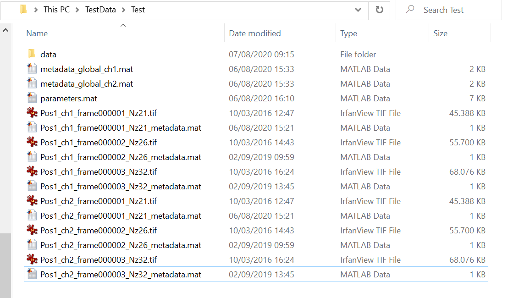
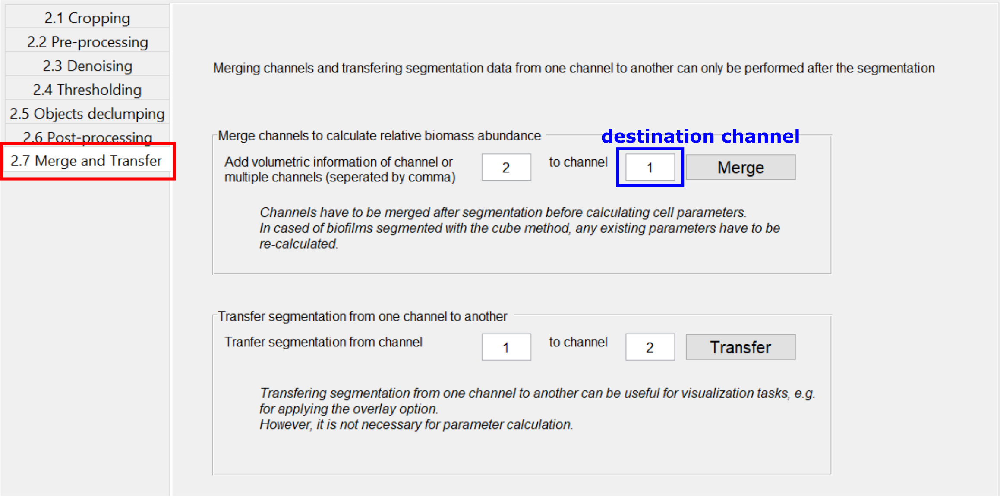
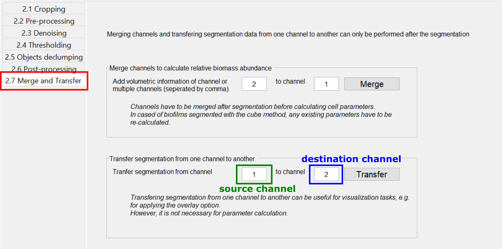
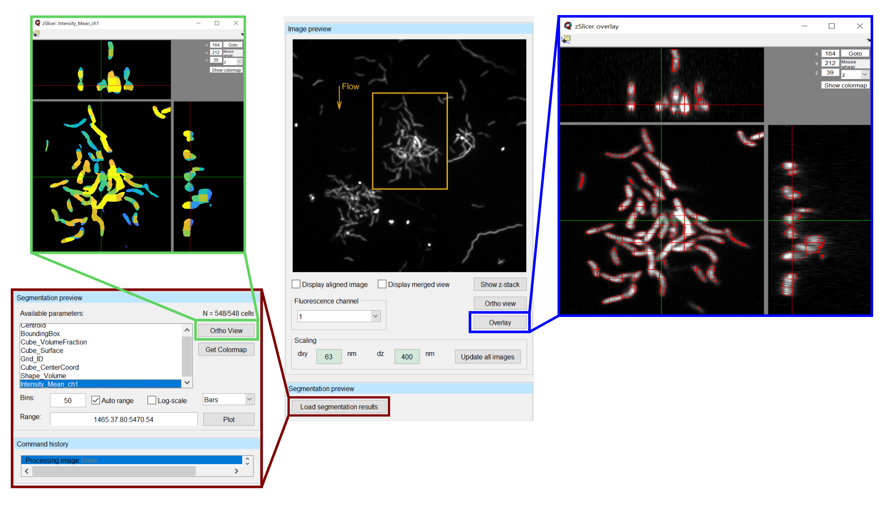

.. _segmentation:

========================
Segmentation
========================

The :guilabel:`Segmentation` tab allows you to set all parameters to extract 3D objects from the imported microscope data.

BiofilmQ has two approaches for quantifying biofilm properties in space and time, which are based on segmentation of the biofilm images:

- **Case 1: The properties you are interested in do not require single cell detection or your image resolution is not sufficient to detect individual cells.**

  In this case, you can use the cube-based segmentation of BiofilmQ. during which the 3D biofilm biovolume is detected via thresholding and divided it into cubic pseudo-cells. Each cube is then treated as a single pseudo-cell for analysis purposes, for which fluorescence, architectural, spatial, and many more properties are measured. Using this cube-based approach, it is possible to analyze the biofilm-internal structure, by performing biofilm image cytometry (analogous to flow cytometry, but with spatial features), based on the quantification of many parameters for pseudo-cells.
- **Case 2: You already have a single-cell segmentation from another tool (e.g. our StarDist OPP tool) and would like to analyze single-cell data based on this segmentation.**
  In this case, you can import your segmentation into BiofilmQ using the label image approach. All subsequent analysis (parameter calculation, visualization…) can then be performed as usual based on the imported segmentation. This option was added in the 2023 release of BiofilmQ version 1.0.0 and is **the only way to analyze single-cell properties**.

Segmentation for **Case 1** (biovolume detection followed by cube segmentation):
================================================================================

An important step in the analysis is that BiofilmQ must be able to identify the biovolume of the biofilm. The segmentation quality can have a large impact on the analysis results. To perform accurate biofilm biovolume segmentation for a wide variety of image types and signal levels, BiofilmQ includes three different segmentation options: 

#. Automatic segmentation via classical algorithms, such as Otsu, Ridler-Calvard, robust background, or maximum correlation thresholding. 
#. Semi-manual segmentation supported by immediate visual feedback.
#. Import of pre-segmented images into BiofilmQ. If users choose to import pre-segmented images, we recommend general-purpose segmentation software tools such as ilasik or convolutional neural networks (e.g. U-Net), which may be trained for particular image types, fluorescence levels, or biofilm morphologies, to give extremely high semantic segmentation accuracy in our experience.

After any automated segmentation of the biofilm biovolume, we recommend a visual inspection of the accuracy of the segmentation result, which is displayed in the BiofilmQ user interface.

Following the detection of the biofilm biovolume, BiofilmQ can dissect the biofilm biovolume into cubes of a user-defined size (which may have the same size as cells). For these cubes, spatially resolved properties can be computed in a “cube cytometry”. Alternatively, users may import a single-cell segmentation via a binary image or labeled image into BiofilmQ, to perform single cell cytometry with BiofilmQ.  

Quick Start
========================

* Select one or several image file(s) in the :guilabel:`Files`-panel.
* Use the :guilabel:`Selected image(s)`-button in the :guilabel:`Image range`-panel to include the selection in the segmentation.
* Click on the tab :guilabel:`2. Segmentation`-tab.
* Directly jump to :guilabel:`2.6 Object declumping` and add a grid side length.
* Press button :guilabel:`Segment cells` to start the segmentation.
* Once the segmentation is finished, you can inspect the segmentation result by using the :guilabel:`Overlay`-button in the :guilabel:`Image preview`-panel.

This is only a minimal working example. Even though the default values will often produce reasonable results, you can improve the
segmentation results by optimizing the segmentation parameters according to your input files.

We will explain the influences of each parameter in the following step-by-step explanation.

Segmentation for **Case 2** (import of single-cell segmentation):
=================================================================

In case you already have a single-cell segmentation and want to import it into BiofilmQ, please follow the steps in :ref:`segmentation_import`.

Step-by-Step Explanation
===========================

.. raw:: html

	<iframe width="560" height="315" src="https://www.youtube.com/embed/JKi3n4Fqdf8" frameborder="0" allow="accelerometer; autoplay; encrypted-media; gyroscope; picture-in-picture" allowfullscreen></iframe>

The following steps are organized according to the workflow for a general segmentation process.

* :ref:`cropping`
* :ref:`pre-processing`
* :ref:`denoising`
* :ref:`thresholding`
* `Object declumping <#objects-declumping>`_
* :ref:`post-processing`
* :ref:`import_segmentation`
* :ref:`merge_segmentation`
* :ref:`transfer_segmentation`
* :ref:`validate_segmentation`

.. _cropping:

Cropping
##########

.. raw:: html

	<iframe width="560" height="315" src="https://www.youtube.com/embed/8vLSU_hAwL4" frameborder="0" allow="accelerometer; autoplay; encrypted-media; gyroscope; picture-in-picture" allowfullscreen></iframe>

To open the cropping settings, select the :guilabel:`2.1 Cropping` tab in the :guilabel:`2 Segmentation` tab. A number of options then appears of the right
side, which are explained in more detail below.

	
With :guilabel:`Select` (indicated in green above) you can define a region of interest (ROI) (*x*, *y*, *width*, *height*) for the currently selected image.

For a long time series, this task can be very tedious. To speed up the cropping process, you can use the following functions:

* Use :guilabel:`Apply to all images` to use the current ROI for all images in the series.

* Manually select the ROI only at key frames of your time series and then use :guilabel:`Interpolate crop rectangles` to automatically-generate the cropping ROI in all frames in between the key frames. (This only make sense for time series data of growing biofilms).

The checkbox :guilabel:`Interpolated crop range` indicates whether the currently displayed cropping settings have been manually selected or are the result of the interpolation method.

In contrast to the ROI in :math:`x` & :math:`y`, the maximal :math:`z` height (:guilabel:`Z-cropping`) is used for all files in the current *Experiment folder*.

.. note::

	 * When your time series exhibits a lot of drift between the single images, you should use :ref:`image_alignment` and enable :guilabel:`Apply registration` prior to the ROI selection.
	 * To delete all croppings of the time series, you can delete the crop definitions completely and press :guilabel:`Apply to all images`.
	 * If the selected cropping region is smaller, the segmentation will be computationally faster and the resulting data-files will be smaller.

Advanced options
**********************

:guilabel:`Reference cropping` will restrict your segmentation results to a fixed position and size. If individual ROIs are larger than the reference cropping, the offset will be cut off.

This feature is particularly useful if you want to create movies of a growing biofilm that is initially small. The initial crop frame can be small. This increases the processing speed.
The final result will have a fixed size and position according to the reference cropping. This allows you to use the segmentation result directly as frames in a time-lapse movie.

If your biofilms were grown in a flow chamber, you may want to indicate the flow direction in the preview image. The text field :guilabel:`Direction of flow` changes the direction of the small flow indicator in the image preview.

.. _pre-processing:

Pre-processing
####################

Select the :guilabel:`2.2Pre-processing` tab to change the following settings:

By default BiofilmQ assumes that your biofilm grows from the bottom of the z-stack upwards. If due to your particular experimental setup the biofilms grow from top to bottom, you can enable :guilabel:`Invert stack`.

:guilabel:`Correct tilted coverslide` (experimental) if the checkbox is enabled, BiofilmQ tries to correct the orientation of the brightest plane to a perfect planar orientation.

:guilabel:`Scale up/down` change the image resolution by interpolation.

.. _denoising:

Denoising
####################

.. raw:: html

	<iframe width="560" height="315" src="https://www.youtube.com/embed/EX5gOnhi9Co" frameborder="0" allow="accelerometer; autoplay; encrypted-media; gyroscope; picture-in-picture" allowfullscreen></iframe>

The biggest obstacle for threshold-based segmentation is a low signal-to-noise ratio. We implemented three different filters which can reduce the noise in your image z-stacks significantly.

Convolution
******************
Reduces salt-and-pepper noise by averaging each pixel with the values of the surrounding pixels. The kernel size indicates how large the used region for the averaging operation will be, where the first number
will be used for averaging in the xy-plane and the second number of averaging in z-direction. This option is highly recommended and the default value works 
well in most scenarios. By increasing the kernel size, the convolution can also be used to soften the edges of your objects, filling 
spaces in between them, which can be advantageous for the analysis in some scenarios. For more detail, watch our Tutorial on denoising.

Median filter along z
************************

Fast moving or floating cells that are not part of a biofilm are in most cases only captured in a single slice during the image acquisition. By applying a median filter in :math:`z` direction, the signal of floating
cell is strongly suppressed such that most floating cells will not be detected by the thresholding method anymore.

Top-Hat filter
**********************

Reduces low frequency noise. This option is particularly useful for reducing the background (out-of-focus) fluorescence in confocal microscope images or for correcting inhomogeneous lighting conditions. The given pixel size should be larger than the largest expected cell size, otherwise
information about the sample is destroyed.  (`Example <https://de.mathworks.com/help/images/ref/imtophat.html?searchHighlight=imtophat&s_tid=doc_srchtitle#d120e163102>`_)

.. _thresholding:

Thresholding
####################

.. raw:: html

	<iframe width="560" height="315" src="https://www.youtube.com/embed/kGwFJkXe0Lw" frameborder="0" allow="accelerometer; autoplay; encrypted-media; gyroscope; picture-in-picture" allowfullscreen></iframe>

At the moment there are five different thresholding approaches available (four automated thresholding algorithms, and one manual thresholding workflow):

* **Otsu**: The `Otsu <https://de.mathworks.com/help/images/ref/multithresh.html>`_ thresholding method is the most widely used thresholding method for images and works reasonably well for biofilm image data.

* **Ridler-Calvard**: The `Ridler-Calvard <https://www.sciencedirect.com/science/article/pii/S0167865512000050>`_ thresholding is an iterative application of the Otsu thresholding method.

* **MCT**: The abbreviation MCT stands for `maximum correlation thresholding <https://doi.org/10.1016/j.jneumeth.2010.08.031>`_

* **RobustBackground**: Discards the all values outside the 5-95% intensity range. The threshold value is set to :math:`\mu + 2\sigma` of a gaussian approximation of the remaining values, where :math:`\mu` is the mean value, and :math:`\sigma` is the the standard deviation of the gaussian distribution.
* **Manual**: Manually selecting an intensity threshold value for every image in the *Experiment folder*.

 
If you choose the Otsu thresholding method you have to specify how many intensity classes you expect in the image stack and in which classes you expect cells. 
Usually 2-class thresholding is sufficient. In some cases 3-class thresholding can be beneficial:

* If you have a small coverage of the substrate with biofilms, class 2 should be assigned to the background. 
* If you have large biofilms, class 2 should be assigned to the foreground (i.e. it should also be added to the biofilm biovolume).
* If you are using a fluorescent reporter or stain which results in some cells being extremely bright while the major fraction is much dimmer, 2 intensity classes should be reserved for cells to avoid detection of only very bright cells.
* Crosstalk might lead to a situation where two classes are useful to fully cover the background and one class remains for the actual cells.

In case the selected automatic thresholding methods always result in a threshold being a bit too low or too high, the result can be adjusted with the sensitivity value which acts as a scaling factor for the automatic threshold.

With the prominent button :guilabel:`Open ortho view of selected stack for threshold determination` (marked blue in screenshot below) you can manually change 
the threshold value for the manual background determination interactively. For each update the influence on the segmentation is visualized in an ortho-view 
representation of your input stack. In this view, all pixels indicated in blue are considered background, all greyscale pixels will be identified as biovolume.
If you selected an automatic thresholding approach, the button allows you to interactively modify the sensitivity value.

With the drop-down menu :guilabel:`Determine threshold visually` (indicated orange in the screenshot below)you can select whether the images should go through 
all previously defined noise reduction steps, or whether you determine the threshold based on the raw input images (faster but less accurate). The two images
on the right side below show an example of the difference that applying or not applying the denoising steps can make. 

.. _objects-declumping:

Dissecting the biofilm into cubes: Object Declumping
##############################################################

In general a threshold-based segmentation approach results in one large 3D biofilm volume. To analyse properties inside this volume with spatial resolution, the idea of
a cube-based segmentation comes into play. We can dissect a large biofilm volume into small cubic volumes.
If the biofilm is reasonably large and the cube grid size is the same as the average
cell size within the biofilm, we can assume that each cube volume contains only a few cells 
(i.e. on average, just one cell volume). For these *pseudo-cell* cubes we can perform many `Parameter Calculations <cell_parameter_calculation.html>`_.

However,  note that the cube-based object declumping does not make sense in 
case the size distribution of connected clusters is of interest. In this case, the :guilabel:`Dissection method` should be set to :guilabel:`None`, so 
that no cubes will be generated.

If you are importing a segmentation from a label image, the :guilabel:`Label image` dissection method should be chosen.

.. _post-processing:

Post-processing
####################

Based on the segmentation results, we can try to filter out debris as well as artefact objects, which are too small to represent a living cell.

* :guilabel:`3D Median of binary image` *polishes* the volumes such that sharp edges are suppressed and the segmentation results look more like *biological* samples. Objects only present in one slice will be removed.

* :guilabel:`Remove small voxel cluster` erases any *debris* which is smaller than the defined voxel size (= volume in pixel).

* :guilabel:`Remove bottom` deletes the given number of slices at the bottom of each image stack. This can be used to remove slices which only contain images of the substrate below your biofilm.

.. _import_segmentation:

Import segmentation
####################
.. note::
    This section applies only to old BiofilmQ versions (version numbers <1.0.0). For newer BiofilmQ versions (version numbers >=1.0.0) see the separate `segmentation import <segmentation_import.html>`_ section.

To import a segmentation in the old BiofilmQ versions (version numbers lower than 1.0.0), you will first need an image that represents your segmentation result. This can be a binary image, where white areas are biovolume
and black areas are background, or it can be a label image, in which each object is colored in a different intensity value as shown in the examples below.

This image now needs to be introduced as a new channel into BiofilmQ. To do so, you need to perform two steps:

* Create a tif-stack with the same format as the BiofilmQ tif-stacks. If your segmentation image is present as a series of tif files, you can achieve this for example
  by using the BiofilmQ tif import. Alternatively, use a 3rd party software such as ImageJ to obtain a tif stack where each tif-slice respresents a z-slice. Then,
  add one more layer at the bottom of this stack. This is the overview slide - the image that will be shown in the preview area of BiofilmQ. BiofilmQ chooses this overview
  to be the projection of all layers, but you are free to use any other visualization, for example a copy of the bottom-most layer.

* Rename the tif stack such that it shares the same name as the fluorescent image on which your segmentation is based, but choose the channel index to be one number higher than 
  the maximum fluorescence channel. For example, in the directory below, there is a series of images present, all following the naming scheme Pos1_chX_frame00000Y.tif where X is 
  the channel number and Y is the frame number. Since 2 is the highest channel number in this example, your new channel would follow the naming scheme Filename_ch3_frame00000Y.tif.

.. note::

	 * If you are using the custom tif import for transferring your original data into the BiofilmQ format, you may want to directly from the start add your segmentation images 
	   as an additional channel to your data. This way you will avoid having to go back to this step in the future. 
	 
	 * When importing a binary image, objects need to be separated in order to be recognized properly. If this is not the case for your image, consider using a label image instead.

Once your segmentation images have been included in BiofilmQ, select their channel number. Then, perform a segmentation **without applying any filtering steps** in the :guilabel:`Denoising` tab.
Make sure that you uncheck all of the checkboxes. An up- or downscaling step as well as a tilt correction is also not necessary and should not be applied to the data. In the :guilabel:`Thresholding`
tab, choose :guilabel:`manual` thresholding with "0" as the threshold. In the :guilabel:`Objects declumping` tab, choose :guilabel:`None` as the method in case of binary data and :guilabel:`Label image` in the case of a label image
as a segmentation input. Then perform the segmentation.

Once the segmentation has been performed on the label or binary image, you can transfer the results to any other channel by using the Merge and Transfer tab. This will help to visualize 
the results, for example using the :guilabel:`Overlay` option. It is however not required for the parameter calculation, which can equally well be performed on the binary or label image channel.
	 
	 
	 
.. _merge_segmentation:

Merge Segmentation of two channels
######################################

The :guilabel:`Merge`  button in the :guilabel:`Merge and Transfer` tab merges **two or more already segmented** channels into each other.
This is useful if you have two signals and want to calculate an overall statistic of both channels, specifically regarding the spatial 
abundance of biovolume present in each channel. The merged segmentation result will be saved as a segmentation for the destination channel and can be treated as any other segmentation for downstream processing.
Afterwards this channel will no longer contain its original segmentation, only the merged result. However, all original segmentation results
are saved as a backup inside the folder */data/non-merged-data*. To undo the merging simply copy these files back into the original folder 
and replace the file containing the merged data.

This function works differently for cubed and non-cubed biofilms:

- For cubed biofilms the biovolumes of all channels will be merged and cubed again. Now, each cube will contain information about the relative volume abundance in the underlying channels:

  - **Cube_RelativeAbundance_chX** Relative abundance of biovolume in the channel indicated (in %)
  - **Cube_Overlap3D_chX_chY** 3D overlap between biovolume in the channels indicated (in %)

- For non-cubed biofilms the objects in all channels will be put into one data file (or one scene in the VTK-format for 3D rendering), independent of whether there is a physical overlap among objects in different channels. 
  No information on relative abundance or overlap is calculated, since this information only makes sense in the context of cubes. To determine overlap between segmentations of different single-cell segmented channels, you can use the appropriate function in the fluorescence property calculations.

.. warning::
    
    If data is merged, only the measurements which are present in both channels will remain.
    

	
.. _transfer_segmentation:

Transfer segmentation from one channel to another
####################################################

..
  .. note::
   This section is relevant mainly for old BiofilmQ versions (version numbers <1.0.0). For newer BiofilmQ versions (version numbers >=1.0.0) see the separate :ref:`segmentation_import` section.

In some cases it can be useful to transfer the segmentation result from one channel to another, for example if the segmentation was 
performed based on a pre-segmented binary or label image. To transfer a segmentation, use the :guilabel:`Transfer`  button in the
:guilabel:`Merge and Transfer` tab. This will create a renamed copy of the segmentation files of the source channels, such that the copied files are 
recognized as a segmentation result of the destination channel. If there already is a segmentation available for the destination channels,
a backup will be created in the directory "data/backup_transfer".

This transfer of segmentation data is necessary only for visualization purposes, for example using the :guilabel:`Overlay`. For the parameter
calculation, it is irrelevant which channel was used as a basis for segmentation.

.. _validate_segmentation:

Validate segmentation results
##################################
After performing the segmentation, there should always be some time dedicated to verifying that the results do indeed represent what can be seen in the image. The easiest
way to do so is to select an image and press the :guilabel:`Overlay` button. This will open a view in which the image is overlayed with a red outline that represents the 
segmentation. Scrolling through this view enables the user to see the segmentation result in any layer of the image, such that artifacts can easily be identified. Note, that the
calculations required for displaying this overlay may take some time (up to several minutes), so do not get impatient if the view does not open immediately.

A quicker way to view the segmentation results is to load the segmentation preview, by clicking the :guilabel:`Load segmentation results` button below the image preview. This
opens a table, in which a property - for example Mean_Intensity_Ch1 may be chosen and displayed via the Ortho view button next to the table. This view opens faster than the Overlay, but 
does not contain raw data and is therefore less suited for verifying segmentation results. Its does however give a good overview and during later stages of the analysis - after the 
parameter calculation has been performed - it provides a very fast and useful visualization of the spatial distribution of biofilm properties and can be used to verify the parameter 
calculation results.

After the segmentation you can proceed with the :ref:`cell_parameter_calculation`.

