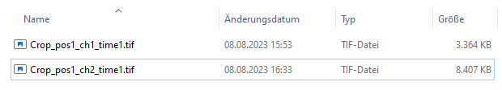
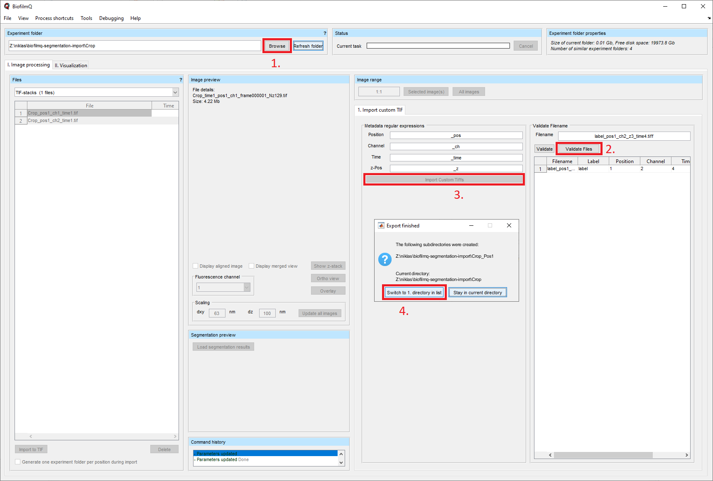
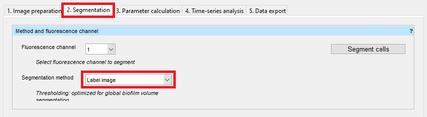
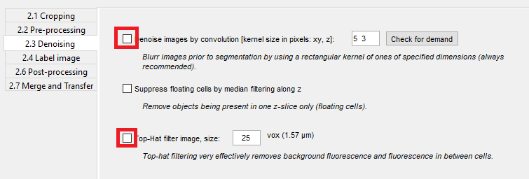
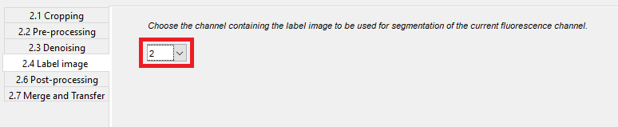
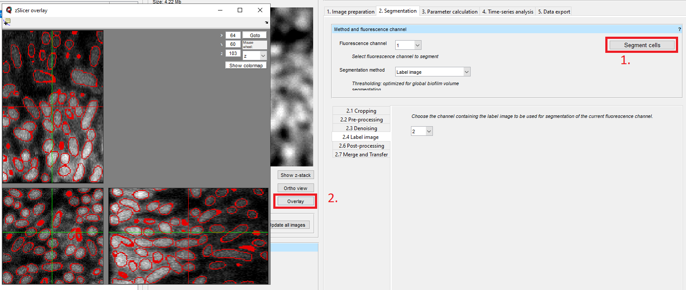
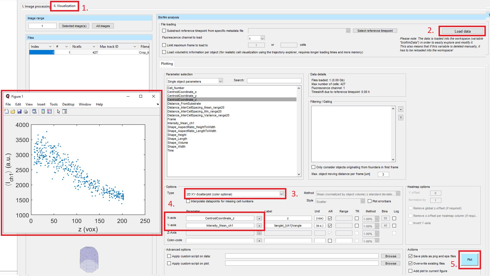

.. _segmentation_import:

==================================
Import of single-cell segmentation
==================================

Segmentation with StarDist OPP
================================
To perform single-cell analyses with BiofilmQ, it is required to import a single-cell segmentation into BiofilmQ. To perform accurate single-cell segmentation of 3D images of bacterial biofilms, we developed the tool StarDist OPP. We recommend using `StarDist OPP <https://github.com/gatoniel/merge-stardist-masks/>`_, and you can get started by reading the `StarDist OPP tutorial  <https://merge-stardist-masks.readthedocs.io/en/latest/napari-plugin.html>`_. However, any other software can be used to generate single-cell segmentation masks that can be imported into BiofilmQ.

Segmentation mask import
========================

BiofilmQ expects a "label mask" for the segmentation import. This is an image of the same size as the original microscope image (i.e. the same pixel numbers). In this label mask, all pixels that do not belong to a cell have the value zero.
All other pixels have values greater than zero. Pixels that belong to the same cell have the same value, and this value is not used in any other cell (e.g. all pixels belonging to a specific cell have the value 1, or the value 2, or another integer value). The value fo the pixels that belong to a particular cell can be regarded as the object id of the cell.
Suitable label masks are produced by our StarDist OPP tool, but other image segmentation tools can also produce such label masks. Once you have such label masks for all your microscope images, you can start to import these segmentations (i.e. the labels masks) into BiofilmQ.

Preparation of filenames and manual import
##########################################

BiofilmQ expects the same naming layout (see :ref:`file-import-in-detail`) for the label masks as for the microscope image. BiofilmQ interprets the segmentation contained within the label mask as a separate image channel. In the following example, we used a mimcroscope to acquire an image with just one chanel "ch1". Therefore, we add the label mask as second channel (note the "ch2" in the file name).

Now, you need to manually import the microscope images together with the label masks. In BiofilmQ, via the button :guilabel:`Browse`, you can select the folder containing your data. After you have adapted the naming scheme of your files in BiofilmQ, hit the :guilabel:`Validate files` button and then the :guilabel:`Import Custom Tiffs` button. BiofilmQ will take some time to import the files. After the import, you are asked whether you want to jump directly into the new folder and you should click :guilabel:`Switch to 1. directory in list`.

Label mask import
#################

You can directly jump to the tab :guilabel:`2. Segmentation`. In the dropdown menu, select :guilabel:`Label image` as `Segmentation method`.

We will skip :guilabel:`2.1 Cropping` and :guilabel:`2.2 Pre-processing`. In this example, we do not want to use any denoising, so we deselect the filters in :guilabel:`2.3 Denoising`.

After that, you have to select the channel that is used for the label masks in the dropdown menu of :guilabel:`2.4 Label image`.

Finally, you can click on :guilabel:`Segment cells`. Click on :guilabel:`Overlay` to see the raw fluorescence image overlaid with the imported segmentation.

If you have several fluorescence channels and want to use the imported segmentation on several of them, you have to transfer the imported segmentation to the other channels (see :ref:`transfer_segmentation`).

Single-cell parameter calculation and visualization
===================================================

After the import of the single-cell segmentation into BiofilmQ, we can extract single-cell properties from the image in the tab :guilabel:`3. Parameter calculation`. Select the box for `Fluorescence properties` and hit the button :guilabel:`Calculate object parameters`. Now we will visualize our results by going to the tab :guilabel:`II. Visualization`. Click on :guilabel:`Load data`, select the `2D XY-Scatterplot (color optional)` in the dropdown menu, and add `CentroidCoordinate_z` to the x-axis and `Intensity_Mean_ch1` to the y-axis (see also :ref:`data-visualization`). Finally, hit the :guilabel:`Plot` button and a plot will pop up.

