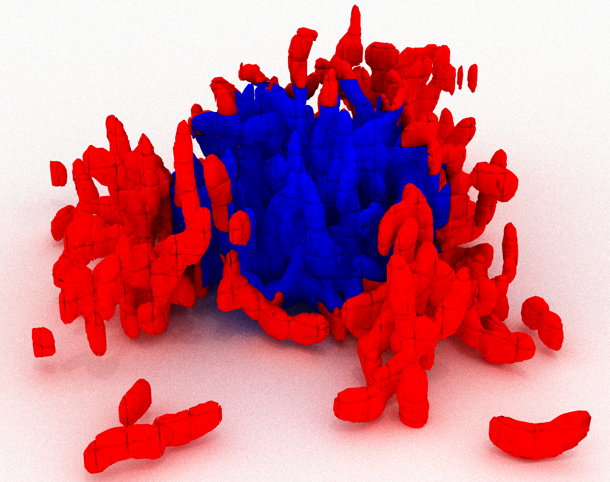
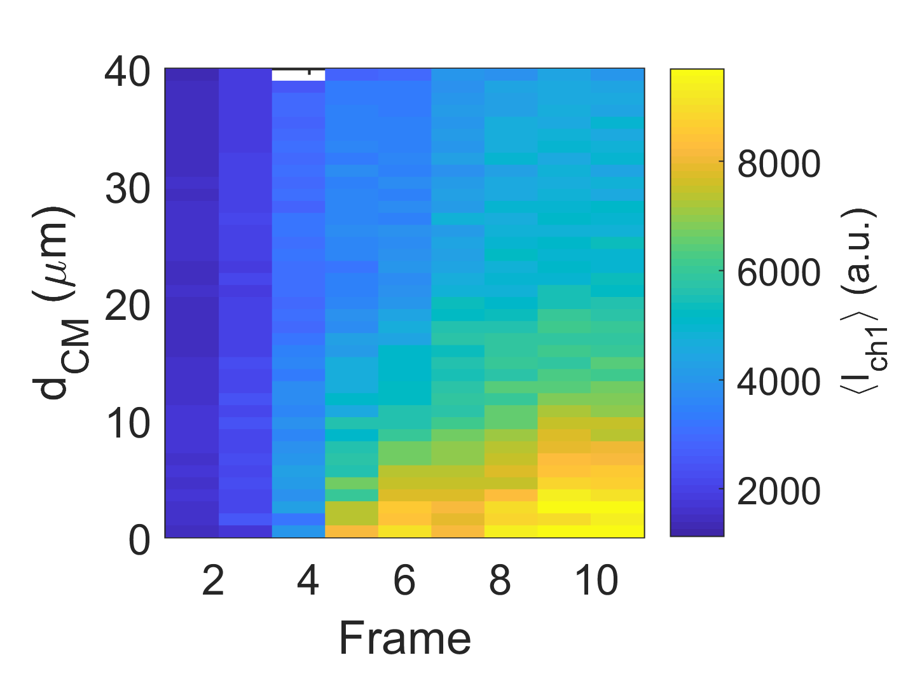
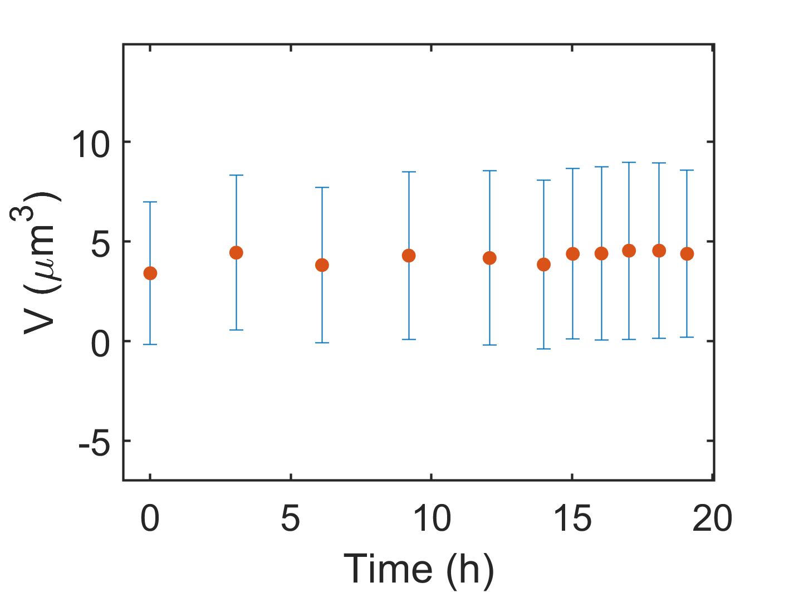
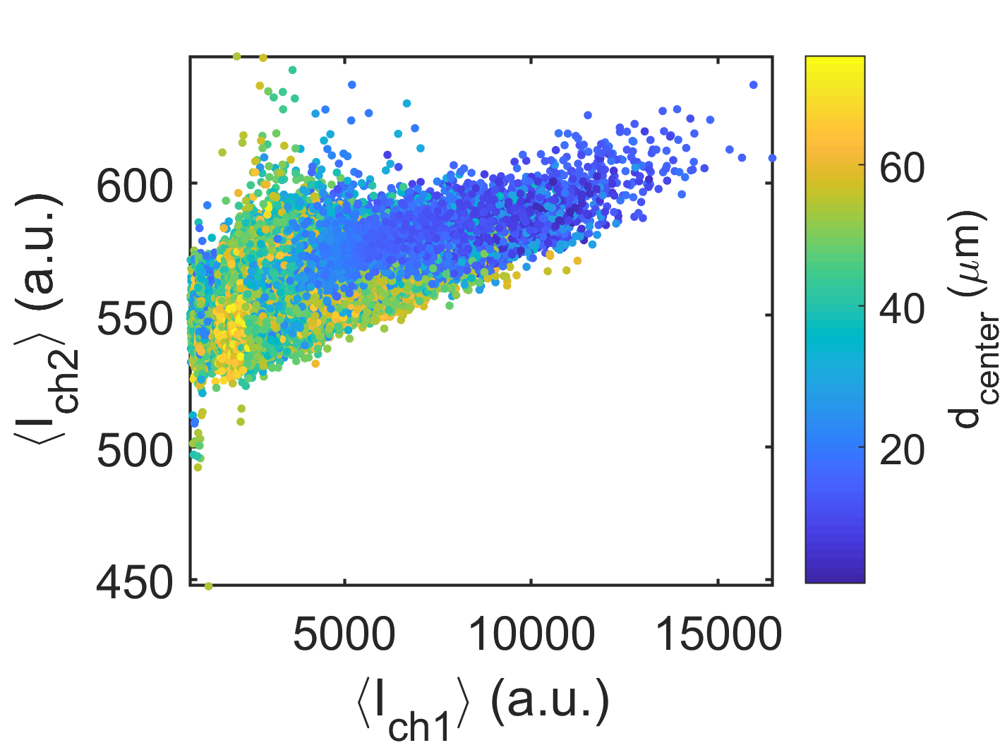
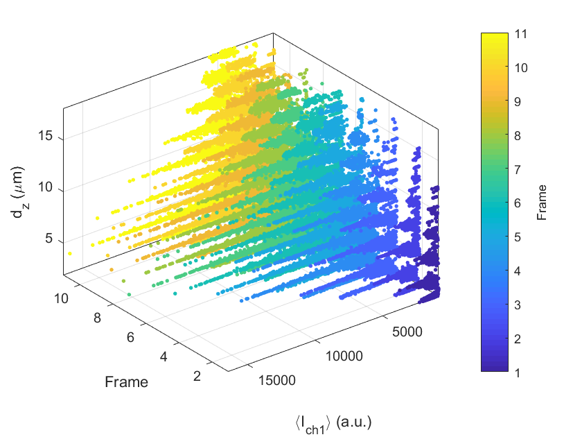
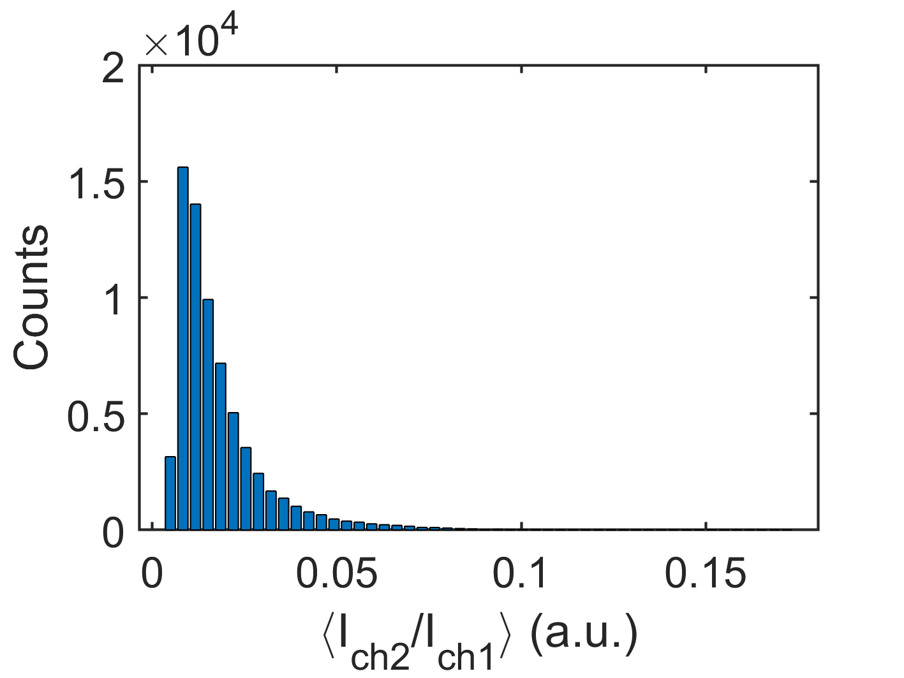
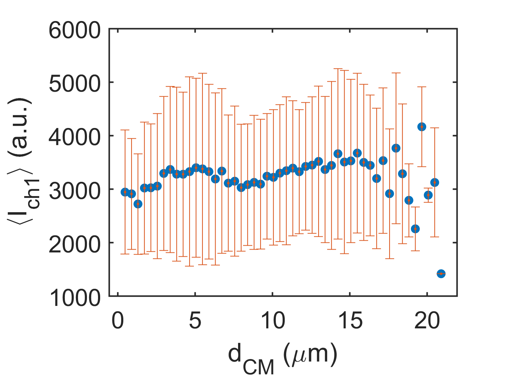

.. _data-visualization:

====================================
Data Visualization
====================================
.. raw:: html

	<iframe width="560" height="315" src="https://www.youtube.com/embed/bC__dewjTyg" frameborder="0" allow="accelerometer; autoplay; encrypted-media; gyroscope; picture-in-picture" allowfullscreen></iframe>

With the BiofilmQ visualization tab you can create publication-quality figures of your measurements.

Quick Start
====================================

* Load data into the visualization process by navigating to the experiment folder you would like to analyze, and then click the :guilabel:`Load data`-button.
* Select in the :guilabel:`Options`-panel the desired plot type. 
* Add parameters to the axes by first selecting them in the :guilabel:`Parameter selection`-panel and then using the small :guilabel:`+` next to the desired axis.
* When no axis is colored red, you can start plotting by using the :guilabel:`Plot` button in the bottom right corner. 

.. note::
    By default figures are automatically stored inside */data/evaluation* in the FIG, EPS and PNG format files with readable labels. 

Step-by-Step 
====================================

Import data
************
When you first open the visualization tab, it is completely empty. To directly interact with the data (and to quickly generate plots)
you have to load data into the workspace. You can load data into the visualization process by navigating to the experiment folder
you would like to analyze, and then click the :guilabel:`Load data`-button.

Options:

* :guilabel:`Subtract reference time point` can be used to change the time reference point. Example: Show a reporter activity over time only after a certain biofilm size is reached.
  * Step 1: Plot biofilm size over time.
  * Step 2: Select in the drop down menu next to :guilabel:`Subtract reference time point` the time (i.e. image frame) when the desired size is reached. All following time points will be shifted according to this reference frame.

	
* :guilabel:`Fluorescence channel to load` define the channel which you want to analyze (assuming segmented data files are present for that channel).
* :guilabel:`Limit maximum frame number` If your time series are quite large, but you are only interested in the biofilm development until a certain point, you can limit the amount of data which is loaded into memory by enabling this checkbox.
	
Parameter selection
********************

The parameter selection panel can be used to conveniently select interesting biofilm parameters that can be assigned to an axis of the figure.

Note that you can change the parameter list from :guilabel:`Single object parameters` to :guilabel:`Global biofilm parameters` in the drop-down menu at top left of the panel.

At the top right you can search the parameters by name. By pressing :guilabel:`Enter` on your keyboard, you can invoke the search.

Similar *global biofilm parameters* are grouped. You can expand a grouped set by clicking on [+] in front of the group. A group includes the following global measures per single-object parameter:

* *max*
* *mean* 
* *mean_biovolume* (weighted by object volume)
* *median*
* *min*
* *p25* (25th percentile)
* *p75* (75th percentile)
* *std* (standard deviation)
* *std_biovolume* (standard deviation, weighted by object volume)

once the parameter *distanceToCenterOfBiofilm* was calculated, parameters with additional suffixes are available:

* *core* (i.e. parameters with the *core*-suffix in the name). All objects closer than half of the 90% percentile distance of all objects to the center of the biofilm.
* *shell* (i.e. parameters with the *shell*-suffix in the name). All objects further away than half of the 90% percentile distance of all objects to the center of the biofilm.

	
Example of shell and core cubes. Core cubes are colored in blue, shell cubes are colored in red.

Plotting options
*****************
.. raw:: html

	<iframe width="560" height="315" src="https://www.youtube.com/embed/1z_Ekdi7q4c" frameborder="0" allow="accelerometer; autoplay; encrypted-media; gyroscope; picture-in-picture" allowfullscreen></iframe>
	
The :guilabel:`Options` panel is designed in such a way that depending on the plot type different input options can be selected.

Regardless of the selected plot type, you can assign parameters to different axes (depending on the plot type: :math:`x`, :math:`y`, :math:`z`, and *color*). Each axis has several input fields:

* :guilabel:`Parameter` Internal name of the calculated biofilm parameter.
* :guilabel:`Label` Axis label in the plot figure.
* :guilabel:`Unit` Defines which unit name is used in the figure label.
* :guilabel:`AR (Auto-Range)` Enables/ disables the manual range settings for the plot axis.
* :guilabel:`Range` either manually defined range, or the hard-coded range based on the parameter type.
* :guilabel:`TR (True-Range)` Enables/ disables a range lookup of the calculated parameter to adapt to the actual data range.
* :guilabel:`Method` Sets the method (min/max, 1-99th percentile) for the :guilabel:`True-Range`-lookup.
* :guilabel:`Bins` (3D Heatmap, Histogram only) defines how many bins should be used for the axis.
* :guilabel:`Log` Enables/ disables logarithmic scaling for this axis.

.. note::

	* You can quickly transfer the selected parameter from the :guilabel:`Parameter selection` with the small :guilabel:`+`-button next to the :guilabel:`parameter`-textbox.
	* If you can not see any markers in you plot. Check whether your *Range* settings are correct.

Additional options
^^^^^^^^^^^^^^^^^^^
	
* If you enable the :guilabel:`Interpolate data points for missing cell numbers`-checkbox the global parameter *cell_number* is interpolated between the measured time points. This option can be useful if you want to use the *cell_number* instead of *time* to measure the developmental state of the biofilm.
* :guilabel:`Method` (only 3D Heatmap, 2D XY-Plot per frame, and 1.5D Histogram) defines how the plotted parameter value is calculated.

  * Mean (weighted by object volume) :math:`\pm` weighted standard deviation
  * Mean :math:`\pm` standard deviation
  * Median :math:`\pm` upper/ lower quartile
  * Sum
  * Min
  * Max
  
.. note:: 

    If the biofilm was dissected using the cube method, averaging of cube-based parameters is biased by the actual volume
	present in each cube. To put less weight on hardly-filled cubes, you can either calculate mean values that are weighted
	by volume in each cube, or you can remove cubes with a very small volume fraction (i.e. less than 0.05).
  
* :guilabel:`Style` (only 2D XY-Plot per frame, Histogram) modifies the marker style of the given plots.
* :guilabel:`Plot error bars` (only 2D XY-Plot per frame and 1.5D Histogram) enables/ disables error bars in the plot.
  
Heatmap options
^^^^^^^^^^^^^^^^^^^
  
  
On the right-hand side you can find the :guilabel:`Heatmap options`, which modifies the selected plot (3D Heatmap only).

* :guilabel:`Y offset` Shifts the calculated parameter the given amount in :math:`y` direction.
* :guilabel:`Normalize by` Divides the heatmap tiles by the given number.
* :guilabel:`Remove global z-offset` (only if *d_z*  is parameter in 3D Heatmap or *z* in all other plot types except 2D histogram) subtracts the minimal value in *d_z*/*z* from the *d_z*/*z* before plotting.
* :guilabel:`Remove z-offset per heatmap column` Removes in each column NaN values until the first data value is reached. Modifies value such that column starts with valid data point
* :guilabel:`Invert Y-axis` Switches from a ascending to a descending :math:`y` axis. 

.. note::

    Y-offset correction options are meant to correct heatmaps of time series with slight shifts in focus positions only!

Actions
*********
Use :guilabel:`Plot`-button to create a plot based on the previously selected options. Additionally you can:

* :guilabel:`Save plots as png and eps files` Save the figures as MATLAB *FIG*-file, as bitmap *PNG* file and in the *eps* vector graphics format. The figures will be saved in the subfolder *data/evaluation* of the current *Experiment folder*. The name of the plots will be based on the plot type and the plotted parameters.

* :guilabel:`Overwrite existing files` If the first option is checked, the already saved plots are not overwritten unless this option is enabled.
* :guilabel:`Add plot to current figure` If you want to accumulate data in a single plot you can use this option.

.. note::
 
	* Creating *eps* figures with a large number of elements (i.e. scatter plots) can take a long time.
	* If you accumulate data in a single plot, the axis labels and the plot range will be set according to the most recently added data. If you want to use multiple axis label, you have to modify the plot manually.

Plot types
*******************
Tutorials provide examples of and details on the different plot types.

* Histogram plots (1D and 1.5D)

.. raw:: html

	<iframe width="560" height="315" src="https://www.youtube.com/embed/acDUKapP-_I" frameborder="0" allow="accelerometer; autoplay; encrypted-media; gyroscope; picture-in-picture" allowfullscreen></iframe>

* 2D XY Plot per frame

.. raw:: html

	<iframe width="560" height="315" src="https://www.youtube.com/embed/tjjDwyS3Hno" frameborder="0" allow="accelerometer; autoplay; encrypted-media; gyroscope; picture-in-picture" allowfullscreen></iframe>

* Kymograph and Demograph plots

.. raw:: html

	<iframe width="560" height="315" src="https://www.youtube.com/embed/yoSqEyAWhIg" frameborder="0" allow="accelerometer; autoplay; encrypted-media; gyroscope; picture-in-picture" allowfullscreen></iframe>
	
* Scatter plots (2D and 4D)

.. raw:: html

	<iframe width="560" height="315" src="https://www.youtube.com/embed/G9Mt2NC3mro" frameborder="0" allow="accelerometer; autoplay; encrypted-media; gyroscope; picture-in-picture" allowfullscreen></iframe>

Filtering/ Gating
******************
.. raw:: html

	<iframe width="560" height="315" src="https://www.youtube.com/embed/o4e7QzHAo7A" frameborder="0" allow="accelerometer; autoplay; encrypted-media; gyroscope; picture-in-picture" allowfullscreen></iframe>
	
Analogous to flow cytometry, BiofilmQ offers the ability to apply gates/ filters to your data, to analyze separate subpopulations of your data separately. If you want to use only a subset of the calculated data, you can use the filtering field to define multiple conditions before plotting the data. Filtering does not work with global parameters.

A valid filtering conditions consists of a calculated parameter (i.e. Volume), an operator (i.e.: *>, <, <=, >=, ==, ~=, see `MATLAB comparison operators <https://de.mathworks.com/help/matlab/matlab_prog/array-comparison-with-relational-operators.html>`_), 
and a numeric value. Multiple conditions can be joined with logical operator (i.e.: *| (or), & (and), see `MATLAB logical operatorsy <https://de.mathworks.com/help/matlab/matlab_prog/matlab-operators-and-special-characters.html>`_ )*. Next to the :guilabel:`Filtering / Gating` text field you find a small :guilabel:`+` button which can be used to add the currently selected parameter to the filtering rule.

.. note:: 

    If the biofilm was dissected using the cube method, averaging of cube-based parameters is biased by the actual
	biomass present in each cube. To put less weight on hardly-filled cubes, you can either calculate mean values that are weighted by the volume of each cube, or you can remove cubes with a very small volume fraction (i.e. less than 0.05) 

Advanced options
*****************
.. raw:: html

	<iframe width="560" height="315" src="https://www.youtube.com/embed/mVhYyCyqfKM" frameborder="0" allow="accelerometer; autoplay; encrypted-media; gyroscope; picture-in-picture" allowfullscreen></iframe>
	
In case the BiofilmQ build-in functionality for data visualization might not be sufficient for all visualization ideas you have in mind, you can use custom scripts before plotting (i.e. custom data analysis) (:guilabel:`Apply custom script on data`) or modification of the already plotted figure with the checkbox :guilabel:`Apply custom script on plot` (i.e. to change the plot colors etc.)

You can find example scripts in the BiofilmQ source folder under *includes/biofilm analysis/custom scripts*.

Color 2D scatter plots by point density 
***************************************

Coloring 2D scatter points by point density is implemented as a custom script (as it has many input parameters). Check :guilabel:`Apply custom script on plot` and browse for the corresponding script in the default custom script folder.

Example Plots
====================================

* 3D Heatmap/Kymograph

* 2D XY-Plot per frame

	
* 2D XY-Scatterplot

	
* 4D XYZC-Scatterplot

* 1D Histogram

	
* 1.5D Histogram

