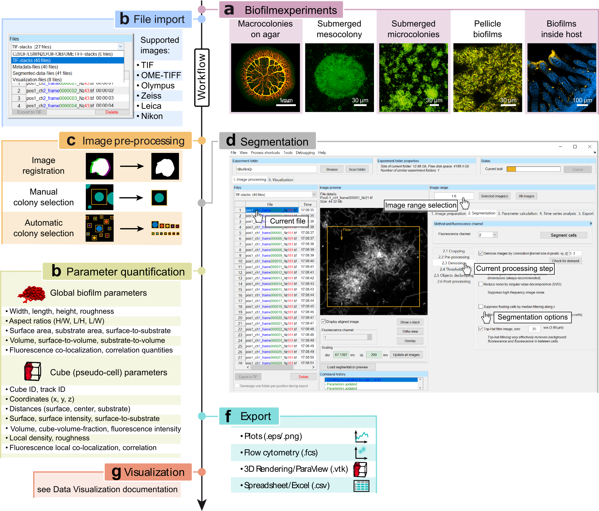
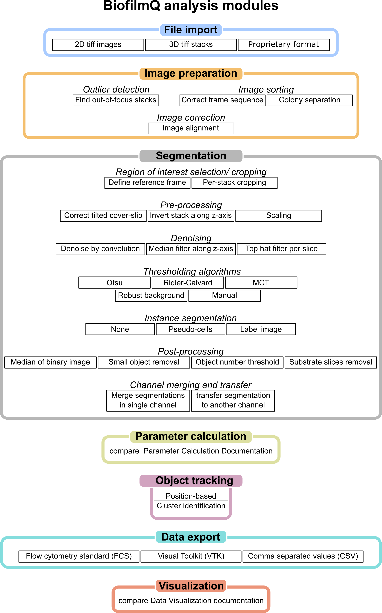

.. _workflow:

==================
Workflow overview
==================

**Workflow of the BiofilmQ graphical user interface for image processing and parameter quantification.**
**a**, Some examples of biofilm growth configurations and image categories that can be analysed with
BiofilmQ. **b**, First, images have to be imported; a wide range of formats are supported, including
3D image formats, and TIF image sequences, based on the Bio-Formats toolbox35. **c**, Next, optional
pre-processing steps including image time series registration, filtering for noise reduction,
and colony separation can be performed to improve the segmentation results. d, Biomass must be
distinguished from background (segmentation), which can be performed automatically using
different thresholding algorithms, semi-manually, or by importing a segmentation represented by a label image
from other image analysis tools. After manual or semi-manual segmentation of the biofilm volume, the biofilm
can be dissected into cubes of a user-defined size.
**e**, Quantitative characterization of the biofilm is achieved via the parameter
calculation for the biofilm as a whole, and for each cube (or each cell) in the biofilm. **f**, Parameter
quantifications and biofilm structural analysis can be exported either as spreadsheets,
flow-cytometry data format, graphs, or as input data for a 3D rendering software. **g**, The
extensive data visualization capabilities that are built into BiofilmQ are described in the section :ref:`data-visualization`. Figure adapted from [`1 <https://doi.org/10.1101/735423>`_] . 

Overview of all analysis modules included in BiofilmQ. The workow can be divided into seven steps, each with multiple options and parameter settings. Figure adapted from [`2 <https://doi.org/21.11101/0000-0007-E856-3>`_].

